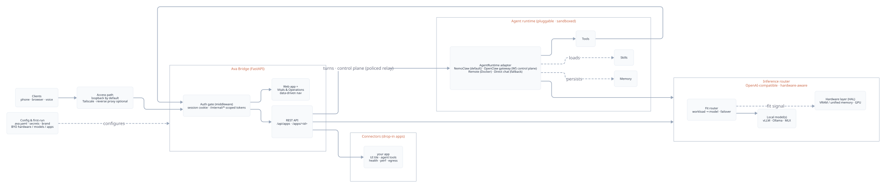

<div align="center">

# Ava

### Your private Jarvis — self-hosted, on your hardware, wired to your world.

[](LICENSE)
[](deploy/README.md)
[](docs/PACKAGING_PLAN.md)

**Ava is a self-hosted personal AI operating layer:** a private, plug-and-play hub
that puts *any* model to work across your **voice**, your **apps**, and your
**creative tools** — and keeps improving itself. It runs on *your* machine, talks
to *your* apps, and answers only to you.

> Not a chatbot. Not a model. A **control layer** for your own AI.

[](docs/assets/architecture.svg)

</div>

---

- 🗣️ **Talk to it** — on-device voice (speech in, speech out), gated to *your* voice.
- 🎨 **Create with it** — image **and** video generation, orchestrated by the agent.
- 🧩 **Wire it to your apps** — drop-in connectors; Ava monitors *and* drives them.
- 🛠️ **It improves itself** — proposes and applies its own code changes, behind approval gates.
- 📊 **See everything** — a live Command Center: throughput, cost/energy, jobs, alerts.
- 🔒 **Private by default** — runs on your hardware; nothing leaves unless you say so.

## What is Ava?

Most AI tools are *one* of these: a chat UI, a local model runner, a voice
assistant, an agent framework, or an image generator. **Ava is the layer that ties
them together** into one assistant you actually own — chat + voice + generation +
app automation + self-improvement, behind a single dashboard, running on your own
hardware with the model of your choice (local **vLLM / Ollama / llama.cpp**, or a
**cloud key**).

## The Command Center

Ava's dashboard is the front door: a **Vitals** tab (her performance — tokens/sec,
time-to-first-token, render times, cost & energy, hardware) and an **Operations**
tab (live jobs, background workflows, connectors, alerts, and the approval-gated
Control Center).

<!-- Recapture with live data via: log in → Vitals tab → save to docs/assets/vitals-dashboard.jpg -->


## Why Ava?

- **You own it.** Self-hosted and single-tenant, on your GPU. Your conversations,
  files, and voiceprint never leave your box.
- **Local Omni brain.** Ava's normal chat runs on the local Nemotron open-model 30B
  stack; Claude/Opus API access is reserved for governed code changes.
- **It does more than talk.** It renders images and video, calls tools, remembers,
  and reaches into your other apps.
- **It watches itself.** A real operations dashboard — tokens/sec, TTFT, render
  times, **cost & energy**, running jobs, alerts, service health. An assistant you
  can't observe is one you can't trust.
- **It gets better.** Ava can edit its own source (with your approval), so it grows with you.
- **Anyone can extend it.** Add your app with a small manifest — no core-code changes.
  Ava picks up its health, metrics, egress policy, and agent tools automatically.

## How it compares

Strong ● · Partial ◐ · None ○ — honest, not marketing:

| Capability | **Ava** | Open WebUI | OpenHands | Home Assistant | ChatGPT/Claude (cloud) |
|---|:--:|:--:|:--:|:--:|:--:|
| Self-hosted / private | ● | ● | ● | ● | ○ |
| Model-agnostic (bring your own) | ● | ● | ◐ | ◐ | ○ |
| Chat | ● | ● | ◐ | ◐ | ● |
| Voice (+ biometric gate) | ● | ○ | ○ | ● | ◐ |
| Image / **video** generation | ● | ◐ | ○ | ○ | ◐ |
| Agent tools / skills / memory | ● | ◐ | ● | ◐ | ● |
| **Self-improvement** (edits own code) | ● | ○ | ◐ | ○ | ○ |
| Drives your **other apps** (connectors) | ● | ○ | ◐ | ● | ◐ |
| Ops **dashboard** (perf / cost / alerts) | ● | ○ | ○ | ◐ | ○ |
| Governance / approval gates | ● | ○ | ○ | ◐ | ◐ |
| Raw model quality (IQ) | ◐\* | ◐\* | ◐\* | ◐\* | ● |
| Polish / mobile / scale | ○ | ◐ | ◐ | ● | ● |

\* inherited from whatever model you plug in.

**The honest read:** Ava is the only column that's Strong across voice + generation +
agent + self-improvement + connectors + observability *together*, self-hosted. It
trails the cloud giants on raw model IQ and polish — because it's the **control
layer, not the brain**. Its job is to put *their* models (or yours) to work, privately.

## What Ava is *not*

- **Not a foundation model** — it orchestrates intelligence, it doesn't produce it.
- **Not a cloud SaaS** — there's no Ava server; you run it.
- **Not a frontier-chatbot replacement** — for raw reasoning, plug in the best model you can.

## Who it's for

Privacy-conscious tinkerers, prosumers, and small teams who want an always-on AI
that runs on their **own** hardware, connects to their **own** apps, and isn't
locked to a single cloud vendor.

## Quickstart

```bash
# Docker (plug-and-play) — pick a profile for your hardware:
cd deploy && docker compose --profile gpu up -d   # or: cpu | cloud | full
# open http://localhost:8096 — the first screen prompts you to set an admin password
```

Prefer bare metal? `ava setup && ava doctor && ava up`. Full guide →
[deploy/README.md](deploy/README.md).

## Add your own app (connectors)

```bash
ava connector new myapp                 # scaffold a manifest
# edit connector.yaml: health probe, perf log, actions
ava connector tools    myapp --write    # generate the agent tools
ava connector policies myapp --write    # generate its egress policy
cd agent && ./install.sh                # deploy — zero core-code changes
```

Ava then monitors your app in the dashboard, charts its performance, and can call
its actions natively. See the [Connector SDK](docs/CONNECTOR_SDK.md).

## Under the hood

A FastAPI **bridge** (web app + API + dashboard) fronts a sandboxed **agent
runtime** (tools, skills, memory) and an OpenAI-compatible **inference router**
for the local open-model model. Image/video runs on **the GPU service**. Everything else —
the apps Ava monitors and drives — is a **connector** you can drop in.

- **Architecture** → [system overview](docs/assets/architecture.svg)
- **Productization roadmap** → [docs/PACKAGING_PLAN.md](docs/PACKAGING_PLAN.md)

## License

[Apache-2.0](LICENSE) © The Ava Authors. Bundled models and third-party components
carry their own licenses — see [NOTICE](NOTICE).
