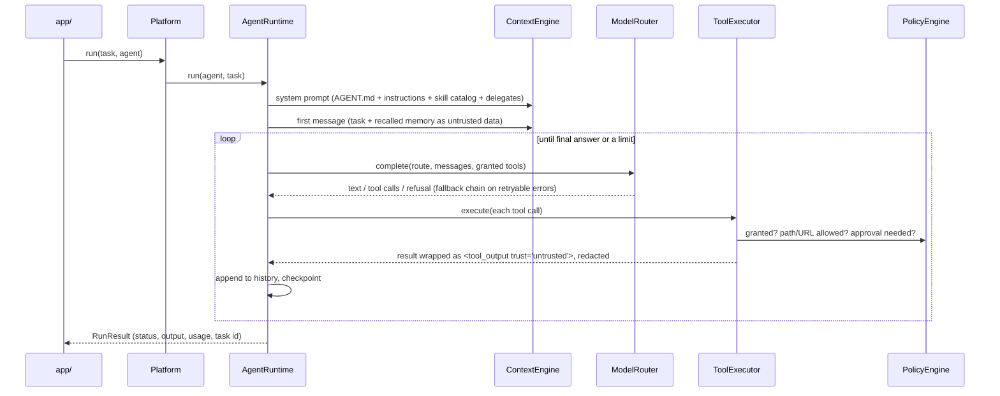

# Architecture

How the platform is put together and why. For step-by-step changes see `extending.md`;
for putting it into a project see `adoption-playbook.md`.

## Layers

```
            app/  (CLI, API, UI, bots, A2A server)          <- product surfaces
              |  runtime.Platform  (the only entry point)
   +----------v-----------------------------------------------------------+
   | orchestrator.py   delegation (model-driven) | workflows (code-driven) |
   | agent_runtime.py  the loop: model turn -> tool calls -> repeat       |
   | context_engine.py system prompt + first message                      |
   | model_router.py   route -> fallback chain -> provider adapter        |
   | tool_executor.py  THE choke point: grant, schema, sandbox, approval, |
   |                   timeout, truncate, redact, wrap-as-untrusted       |
   | policy_engine.py  hard rules from policies/*.yaml                    |
   | memory / tasks / checkpoints / telemetry                             |
   +----------^-----------------------------------------------------------+
              |  loads + validates (runtime/config.py against schemas/)
   agent.yaml  AGENT.md  agents/  skills/  workflows/  tools/registry.yaml
   models/  policies/  memory/  observability/  sandbox/  mcp/  protocols/
```

Everything above the line is **config you edit**; everything inside the box is **code that
enforces it**. Projects mostly change config. The runtime is small enough to read in one
sitting, and replaceable (see *Swapping the runtime*).

## Lifecycle of a task



Every step is a span in `state/sessions/<session>/trace.jsonl` (OpenTelemetry GenAI
attribute names); every denial and approval is in `audit.jsonl`.

## Soft and hard

The single most important design rule.

| Soft (asks the model) | Hard (enforced in code) |
|---|---|
| `AGENT.md`, `agents/*/instructions.md`, `skills/*/SKILL.md`, `knowledge/` | `policies/*.yaml` via `policy_engine.py` and `tool_executor.py` |
| "Don't touch production" | `shell.run` denied; writes confined to `artifacts/` |
| "Only use trusted sources" | `network.yaml` allowlist + private-network block on every redirect |
| "Ask before sending email" | `approvals.yaml` gates every `external_write` tool |
| "Never reveal secrets" | `data-access.yaml` denies secret files; `safety.yaml` redacts output, memory and traces |

Prompts are where you shape *quality*. Policies are where you guarantee *safety*. If a rule
would cause real harm when the model ignores it, it must be hard.

Effective permission for a tool call = the agent lists it (`agent.yaml tools`) **and**
policy grants it **and** no deny matches **and** the arguments validate **and** (if
required) a sandbox exists **and** (if required) a human approved. The model only ever
*sees* tools that pass the first three checks.

## Design principles

- **Config is the contract, validated before anything runs.** Every file has a JSON Schema;
  `load_platform` also checks every cross-reference (agent → route → model → provider,
  agent → tool → grant, workflow → agent, memory → namespace). Broken config fails at load,
  with the file and field named — never mid-task.
- **Least privilege, deny by default.** Tools, file paths, network hosts, memory namespaces
  and delegation are all allowlists.
- **Untrusted by default.** Tool output, files, web pages, memory and delegate answers are
  data. They are wrapped and labelled before the model sees them, and nothing they say can
  change permissions — permissions are not in the prompt.
- **Route by capability, not by model id.** Agents ask for `reasoning`, `balanced`, `fast`
  or `local`; `models/` decides what that means today, with fallbacks. Data classification
  decides which providers are even eligible.
- **Progressive disclosure.** The system prompt carries only skill names and descriptions;
  bodies and resources load on demand. Delegates start from a clean context with only their
  task. Stable content goes first so provider prompt caching works.
- **Append-only history.** Never rewrite earlier turns (current Claude models bind thinking
  to history). For very long work, end the task and hand off a summary, or use provider-side
  compaction.
- **Workflows before agents.** When the steps are known in advance, a workflow is cheaper,
  testable and auditable. Use model-driven delegation for genuinely open-ended work.
- **Everything observable, nothing sensitive recorded.** Traces carry sizes, models, tokens,
  tools and outcomes; prompt and completion text only when `capture_content: true`.
- **Evals gate changes.** Offline scenarios pin harness and safety behaviour in CI; dataset
  evals on real routes measure quality before a model or prompt change ships.

## State and data

| Location | Contents | Lifetime |
|---|---|---|
| `state/sessions/<id>/` | `trace.jsonl`, `metrics.jsonl`, `audit.jsonl` | Per session |
| `state/tasks/` | One JSON record per task (`schemas/task.schema.json`), parent links for delegation | Until pruned |
| `state/checkpoints/<task>/` | Last few turns of full history, for `resume` | Until pruned |
| `state/memory/` | JSONL per namespace (or per session / per agent) | `ttl_days` + consolidation |
| `artifacts/` | Agent deliverables, recorded on the task (`schemas/artifact.schema.json`) | Until you delete them |

`state/` is gitignored and must be a persistent volume in deployments.

## Coordination

- **Delegation** (`task.delegate`): an agent hands a self-contained task to an agent in its
  `delegates_to`. The child runs as its own task (own limits, own tools, fresh
  context), linked by `parent_id`. Depth is capped by `max_delegation_depth`.
- **Workflows** (`workflows/*.yaml`): code runs steps in order — `agent` steps, `tool` steps
  (checked against `as_agent`'s grants), and `approval` gates. Later steps template earlier
  outputs (`{{ steps.<id>.output }}`).
- **MCP** brings external tools in as `mcp.<server>.<tool>`; they pass through the same
  executor and policies as native tools.
- **A2A** (optional) exposes skills to other agents; inbound requests are untrusted callers.

## Swapping the runtime

The durable part of this template is the **config and its contracts** — agents, policies,
tools, routes, schemas, evals. The reference runtime is one way to execute them. If a
project already uses an agent framework, keep the config and adapt:

| Concept | Reference runtime | If you adopt an SDK, implement it as |
|---|---|---|
| Agent definition | `agents/<name>/` | The SDK's agent object, built from `AgentSpec` |
| Tool gate | `ToolExecutor.execute` | The SDK's pre-tool-use hook / permission callback calling the same `PolicyEngine` and `ApprovalManager` |
| Delegation | `task.delegate` | The SDK's sub-agent / handoff mechanism, restricted to `delegates_to` |
| Model choice | `ModelRouter` + `models/` | Resolve route → model id from `models/` before constructing the SDK agent |
| Tracing | `telemetry.py` | The SDK's tracing, exported with the same GenAI attribute names |

The rule that must survive any swap: **every tool call passes `PolicyEngine` and the
approval check in code**, and `python scripts/check.py` keeps passing.
