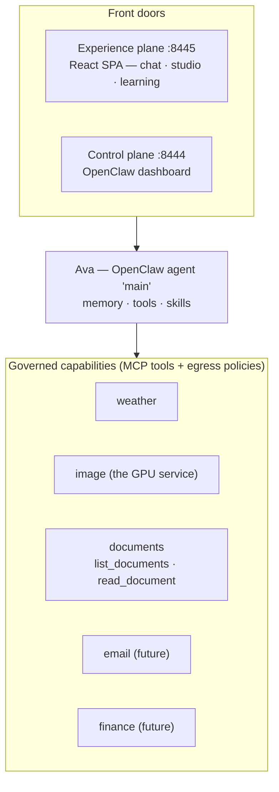

# Ava — Architecture & Roadmap

Owner: you · Host: your GPU box · Last updated: 2026-07-01

> **Companion docs:** the comprehensive system overview, on-disk location map,
> and flow diagrams live in the root [README.md](../../README.md); the detailed
> component/file reference is in [COMPONENTS.md](COMPONENTS.md). This document
> focuses on the **two-plane design, security rules, and roadmap**.

This document defines the **two-plane architecture** for Ava and the rules for
growing the personal `:8445` app into a full "dashboard for my life" (weather,
email, investments, banking) **without** turning it into a security liability.
All future work should be designed to fit this split.

---

## 1. The two planes

Ava is **one agent** reached through **two front doors**. They are not two
assistants — both talk to the same OpenClaw agent (`main`), so they share the
same memory, tools, and skills.

| Plane | URL | Process | Purpose |
|-------|-----|---------|---------|
| **Control / Admin** | `https://<your-tailnet-host>:8444` | OpenClaw dashboard → `127.0.0.1:18789` | Agent config, gateway, model, egress policies, device approvals. The "engine room." Rarely touched. |
| **Experience / User** | `https://<your-tailnet-host>:8445` | `phone_bridge.py` (FastAPI) → `127.0.0.1:8096` | Ava as *your* personal app: private push-to-talk voice, inline images, and life-dashboard widgets. The daily driver. The UI is a **Vite + React + TypeScript SPA** with a Claude.ai-style look (warm-dark theme, icon-rail sidebar, native app views + a **Learning** view); the original single-file UI stays at `/legacy`. |

> **What's Shared:** Memory, tools, skills, learning state, approvals, and
> user settings are **identical** across both planes. A proposal approved in
> `:8445` is approved in `:8444`. A chat turn in one plane is readable in the other.
> **There is only one Ava.**

> The `documents` tools call back to the Experience app's token-gated
> `/internal` surface via the `ava-bridge-gw` forwarder — see the knowledge
> callback schematic in [README.md](../../README.md#23-knowledge-callback--reading-uploaded-documents).

### Why two apps (and not just `:8444`)

- OpenClaw's built-in voice supports **only cloud providers** (`openai`,
  `elevenlabs`, `azure`). The dashboard **voice button** uses the **realtime
  WebSocket** path (`/v1/realtime`).
- Private, on-device push-to-talk (faster-whisper + Piper + voiceprint gate)
  only exists in the `:8445` app.
- Providers *do* accept a custom `baseUrl`, so the dashboard could in principle
  be pointed at a local server — but:
  - **Realtime shim** = emulate OpenAI's realtime WS protocol locally =
    complex/fragile, breaks on updates. **Not recommended.**
  - **Turn-based shim** = a small local OpenAI-compatible REST server
    (`/v1/audio/transcriptions` + `/v1/audio/speech`) wrapping whisper+Piper =
    simple — **only if** the dashboard can run non-realtime voice (unverified).
- `:8444` also can't display **host-rendered images** (the PNG lives on the host
  filesystem; the dashboard has no way to surface it). `:8445` polls and shows it.

**Decision:** keep `:8445` as the user app; do **not** rebuild voice into `:8444`.

---

## 2. Implementation rules (security-first, modular)

These rules keep the personal app safe and maintainable as it grows.

1. **Keep `:8445` a thin presentation layer.** Real integrations (email,
   finance) live as **Ava MCP tools/skills** under `agent/mcp_server/`, each with **one
   narrow egress policy** (the security boundary). The dashboard calls Ava; Ava
   calls the governed tool. Do **not** hardcode bank/email logic into the FastAPI
   front-end.
   - **BFF exception:** display-only widgets (weather, a read-only balance
     number) may be fetched server-side by the bridge directly for speed.
     Reserve the agent round-trip for conversational or *acting* flows. The one
     sanctioned bypass today is `POST /api/generate` (an explicit user "generate
     image" button → local the GPU service); all *conversational* turns (`/api/talk`,
     `/api/talk-text`) route through the agent so persona/memory/tool-policy apply.

2. **Auth on `:8445` — ✅ DONE (2026-06-28).** Every page, API, and media route
   now requires a valid signed-cookie session (password login); only `/login`
   and `/api/health` are public. Voice turns are *additionally* voiceprint-gated.
   Password = `AVA_PASSWORD` (else generated to `data/auth_password`), cookie key
   = `AVA_SECRET` (else `data/.secret`) — both `0600` and gitignored.

3. **Read-only first; human-in-the-loop for anything that moves money.** Start
   with read-only data (balances, transactions, holdings). Prefer aggregators
   (Plaid-style) with **read-only tokens** over raw bank credentials. Letting Ava
   *initiate* transactions is a separate, higher-risk decision — require a
   confirmation step and least-privilege scopes.

4. **Secrets in a vault/env, never in code or the sandbox.** The sandbox
   isolation helps: Ava has no host filesystem access, so host secrets aren't
   reachable unless deliberately exposed through a tool.
   - **Implemented:** secrets live in a gitignored `.env` (template
     `.env.example`), auto-loaded by the run scripts + `ava-bridge.service`
     (`EnvironmentFile=`); `.gitignore` keeps `.env`, `data/`, and `models/`
     (incl. the biometric `voiceprint.npy`) out of the repo. A real vault
     (sops/age, or a local secret store) is the future step for multi-secret tools.

5. **Watch data residency.** The whole build is on-device by design — vet any
   finance/email aggregator that phones home; keep data local where possible.

6. **Back up agent state.** Ava's memory/identity live *inside* the sandbox and a
   `nemoclaw rebuild` wipes them. `agent/snapshot.sh` (daily via
   `ava-snapshot.timer`) snapshots and prunes them so a rebuild or disk loss is
   recoverable (`nemoclaw <sandbox> snapshot restore`).

7. **Self-improvement infrastructure (code mode + learning cycles).** — ✅ DONE (2026-06-30).
   - **Code mode:** `/api/code/*` routes let you write code intents in natural language; Claude generates staged diffs + reasoning; you approve/reject, or Ava auto-fixes non-critical errors (timeout/large-file/regex) and retries.
   - **Learning cycles:** Separate `CodeLearner` and `ChatLearner` analyze your code edits and chat history, generating improvement proposals (refactoring, caching, anti-patterns, tool gaps). All proposals require approval before applying; feedback (👍/👎) weights future proposals. **Learning state is persisted and shared across both planes** (`:8445` app and `:8444` dashboard) — approve a proposal in one plane and it's approved in the other.
   - **Digests:** Daily/weekly HTML summaries auto-generated at 4am PST; Ava reads her own digests via read-only MCP tools (`ava-email-read` skill).
   - **Rules:** Code changes → Claude; proposals → approval-gated; errors → auto-fix if non-critical; learning → separate code/chat contexts (no cross-contamination); digest → fallback to local file if email fails (never lost).

8. **Models live in one central hub (`~/ai/models`).** — ✅ DONE (2026-07-03).
   Every model on the box — Ava's LLMs, the GPU service latent pipeline weights, and
   TTS/ASR/speaker models — is stored once in the machine-wide **`~/ai/models`**
   single source of truth, catalogued in `~/ai/models/REGISTRY.yaml`. vLLM loads
   from `~/ai/models/_hf` (`HF_HOME`), the GPU service from `~/ai/models/latent pipeline` (via
   `gpusvc/extra_model_paths.yaml`), and voice from `~/ai/models/audio`. Ava's repo
   carries **no** model weights — its `models/` are symlinks into the hub (only the
   biometric `voiceprint.npy` is local). New apps reference this one folder; new
   models are downloaded into it, never into a project.

---

## 3. Roadmap (phased)

Build the **auth + secrets foundation as step zero**, then add widgets in
ascending order of sensitivity:

| Phase | Widget | Access level | Notes |
|-------|--------|--------------|-------|
| 0 | **Auth + secrets layer on `:8445`** | — | ✅ Done. Signed-cookie password login (all routes gated); secrets in gitignored `.env` + `0600` files; repo under git; daily agent-state snapshots. |
| 1 | Weather | live | ✅ Done (native `get_weather` tool). |
| 2 | Calendar / Email | **read-only** | e.g. Outlook via OAuth least-privilege; surface as a tool + skill. |
| 3 | Investments | **read-only** | Holdings/positions display first. |
| 4 | Banking | **read-only** | Balances/transactions via aggregator, read-only tokens. |
| 5 | Any write/action | gated | Much later, maybe never. Confirmation + least privilege required. |

---

## 4. Is this how most people use OpenClaw?

No — and that's fine. Most users use the `:8444` dashboard directly and/or wire
the agent into existing channels (Slack, Telegram, email). A **custom
user-facing app** like `:8445` is the **power-user / builder pattern** — an
intended extension point (the dashboard is just one client of the agent/gateway
API). The trade-off: more capable and personal, but **we own the maintenance and
security** of that layer — hence the rules in §2.
