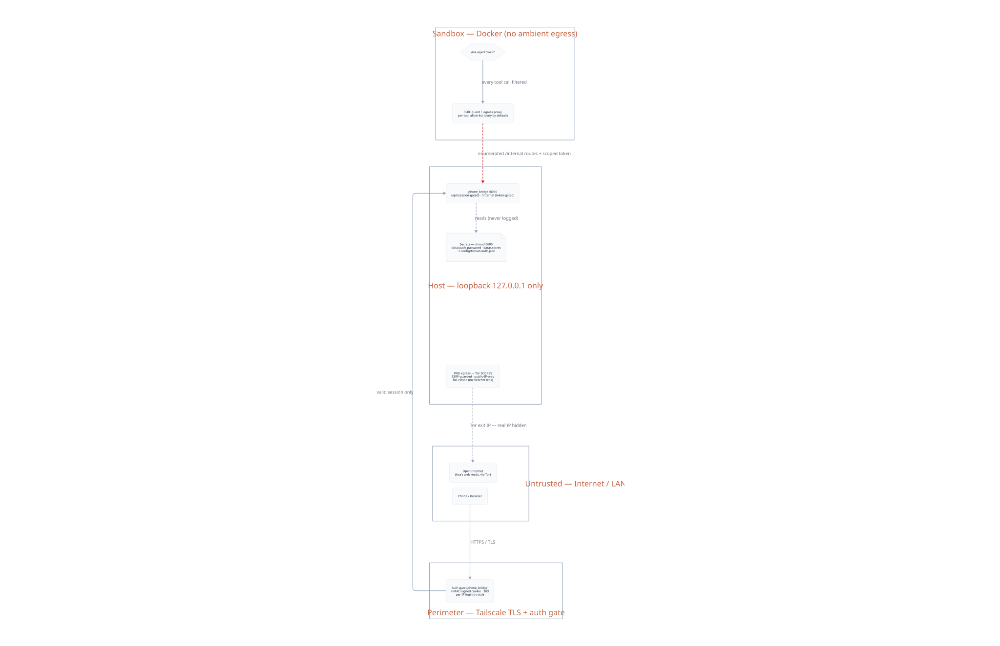

# agent/ — Ava's agent configuration kit

This directory declares everything Ava-the-agent gets when it is provisioned
into its sandboxed runtime (NemoClaw/OpenClaw — see
[docs/AGENT_RUNTIME.md](../../docs/AGENT_RUNTIME.md)):

- **`mcp_server_*/`** — zero-dependency Node MCP tool servers, one per
  capability group (content, productivity, system, admin, wellness, …). Each
  tool is a single `.mjs` module; the `_server.mjs` harness auto-loads every
  module in its folder. Tools reach the host bridge at `/internal/*` with
  HMAC-derived, per-group scoped tokens.
- **`skills/`** — native skills (structured prompts + tool guidance) deployed
  alongside the tools.
- **`policies/`** — deny-by-default egress policies. Hand-authored ones live
  here; per-connector policies are *generated* into `policies/generated/` by
  `ava connector policies <id> --write` (gitignored, derived).
- **`templates/` + `render_persona.py`** — the persona is rendered from
  `ava.yaml` (`brand.*`, `owner.*`) so nothing personal ships in the repo.
- **`install.sh`** — idempotent deploy of all of the above into the sandbox.
  It also picks up an optional gitignored `/overlay/agent/` with private
  servers/skills/policies — that's how a personal deployment extends the kit
  without touching tracked files.

Two planes, in one sentence: the **bridge** (`ava_bridge/`, the web app on
:8096) is the experience plane; the **agent** (this kit, running inside the
sandbox) is the capability plane, and they only talk over enumerated,
token-gated `/internal/*` routes and the inference router.

## The system, in three diagrams

Rendered by `arch.py` from the live architecture manifest and drift-checked
against the running code (services, MCP tools, egress policies), so they show
the system as it actually is, not as it was once drawn.

**System** — every service, plane by plane: front doors, the sandboxed agent
runtime, the category MCP servers, engines, and runtime state.

**Network** — who may talk to whom: ports, loopback binds, and the enumerated
bridge routes.

**Security** — trust zones and gates, from the internet down to the sandbox.

The SSOT manifest (`architecture.yaml`) and the `.d2` sources stay
**deployment-specific and gitignored**; the rendered SVGs above are committed
as the reference topology. `arch.py` (the sync/check/render pipeline) skips
gracefully when the manifest is absent. See also the root
[README.md](../../README.md) and
[docs/CONNECTOR_SDK.md](../../docs/CONNECTOR_SDK.md).
