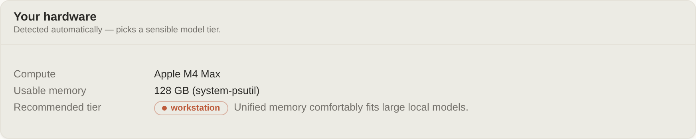

# Installing & running Ava

Ava is **self-hosted and single-tenant**: you run your own instance on your own
hardware, point it at your own models, and connect your own apps. This is step
one of getting started: fork (or clone) the repo, then pick the path for your
machine.

Here is the whole install on a Mac, end to end (sound on):

<video controls playsinline preload="metadata"
       style="width:100%;border-radius:8px"
       aria-label="Narrated screen recording: cloning Ava, running ava setup, doctor, and up on a Mac, then verifying the detected hardware in the app">
  <source src="../docs/assets/install-tour.mp4" type="video/mp4">
  Your browser can't play video. <a href="../docs/assets/install-tour.mp4">Download the walkthrough</a>.
</video>

| Your machine | Install path |
|---|---|
| Mac mini / Studio (Apple Silicon) | [Bare metal with a native engine](#apple-silicon-mac-mini-studio); Docker can't reach the Apple GPU |
| NVIDIA GPU box | [Docker, `gpu` profile](#1-docker-recommended) (vLLM) |
| DGX Spark / unified-memory NVIDIA | [Docker, `gpu` profile](#1-docker-recommended); hardware detection is verified on-device |
| No GPU | [Docker, `cpu` profile](#1-docker-recommended) (Ollama) |
| Just an API key | [Docker, `cloud` profile](#1-docker-recommended) |

However you install, verify the wiring afterwards: open **Setup → Models** and
Ava should show your machine, detected automatically:



Then continue to step two, [picking Ava's brain](../docs/CHOOSE_A_MODEL.md).

---

## 1. Docker (recommended)

Requires Docker and Docker Compose v2. Pick the profile that matches your machine:

```bash
cd deploy

docker compose --profile cpu   up -d   # no GPU  -> Ollama for inference
docker compose --profile gpu   up -d   # NVIDIA GPU -> vLLM
docker compose --profile cloud up -d   # bring an API key, no local model
docker compose --profile full  up -d   # everything, incl. image/video (the GPU service)
docker compose --profile agent up -d   # + full tool-using agent (opt-in, see below)
```

Then open **http://localhost:8096**. The first screen prompts you to create an
admin password, so there is nothing to hunt for in logs.

> **On a Mac (Apple Silicon)?** Skip Docker. Docker Desktop on macOS can't pass
> the Apple GPU through, so inference in a container runs CPU-only. Use the
> bare-metal path below — see [Apple Silicon (Mac mini / Studio)](#apple-silicon-mac-mini-studio).

Good to know:

- **All state lives in one folder** (`AVA_HOME`, default `deploy/ava-data/`):
  config, chats, media, logs, models. To back up, copy that folder.
- **Password**: pin the admin password ahead of time with `AVA_PASSWORD=...` in
  `deploy/.env`; otherwise the first-run screen sets it.
- **Model**: choose one with `AVA_MODEL=...` (gpu profile) or via `ava.yaml`. The
  gpu profile defaults to a small model (`Qwen/Qwen2.5-7B-Instruct`, ~16 GB card)
  so it starts on an ordinary GPU; `install.sh` drops to the cpu profile if
  `nvidia-smi` reports less. Scaling up is the deliberate act:

  | Variable | Default | Notes |
  |---|---|---|
  | `AVA_MODEL` | `Qwen/Qwen2.5-7B-Instruct` | Any model vLLM can serve. |
  | `AVA_TOOL_PARSER` | `hermes` | **Must match the model.** A mismatch returns no `tool_calls` *silently* and every turn runs to timeout. `AVA_SERVE_DRY_RUN=1 AVA_MODEL=... bash deploy/local-serve.sh` prints the right value. |
  | `AVA_VLLM_GPU_UTIL` | `0.90` | Fraction of GPU memory vLLM may take. Lower to ~`0.40` for `--profile full`, where the GPU service shares the pool. |
  | `AVA_VLLM_MAX_LEN` | `65536` | Context ceiling. Must exceed the agent's ~29k-token system context. |

  A *reasoning* model additionally needs `--reasoning-parser`, which compose does
  not template (vLLM rejects a bare flag, so there is no safe empty default). Add
  it via `docker-compose.override.yml`, or use `deploy/local-serve.sh`, which
  resolves both parsers from the model family. See [docs/CHOOSE_A_MODEL.md](../docs/CHOOSE_A_MODEL.md).
- **Inference backend**: chat flows bridge → embedded router (`:8010` in-container)
  → the profile's engine. Each profile sets `AVA_BACKEND_URL`/`ENGINE`/`MODEL`
  defaults (gpu→vllm, cpu→ollama); for `cloud`, set them plus `AVA_INFERENCE_KEY`
  in `deploy/.env` (see the compose header).
- **Agent**: the container runs the tool-less assistant by default. For the
  **full tool-using agent** (self-coding, connectors, memory) in Docker, opt into
  the `agent` profile: set `AVA_AGENT_ENABLED=1 AVA_AGENT_RUNTIME=remote
  AVA_ROUTER_HOST=0.0.0.0`, then `docker compose --profile agent up -d`. This
  runs a separate agent container that mounts the host Docker socket, which is
  **root-equivalent** on the host; it is opt-in for that reason. Full setup and
  the security caveat: [AGENT_RUNTIME.md, Full agent in Docker](../docs/AGENT_RUNTIME.md).

### Verified install (recommended)

Published images are **cosign-signed** (Sigstore keyless; the signature proves
the image came from this repo's release CI). Pull the signed image instead of
building locally by setting `AVA_IMAGE` in `deploy/.env`, and verify it first:

Replace `<version>` below with a tag that exists — see the repository's Releases
page. (`release.yml` publishes an image only on a `v*` tag push, so a tag that has
not been released yet returns 403 from GHCR.)

```bash
# Verify the release image (see SECURITY.md §9 for the exact identity regex):
cosign verify ghcr.io/<owner>/ava-bridge:<version> \
  --certificate-identity-regexp "https://github.com/<owner>/.+/.github/workflows/release.yml@refs/tags/<version>" \
  --certificate-oidc-issuer https://token.actions.githubusercontent.com

echo "AVA_IMAGE=ghcr.io/<owner>/ava-bridge:<version>" >> deploy/.env
docker compose --profile gpu pull && docker compose --profile gpu up -d
```

One-line install on a fresh box (auto-detects GPU/CPU). Run it from inside your
clone, or point `AVA_REPO` at your fork:

```bash
git clone https://github.com/<you>/ava && cd ava/deploy && ./install.sh
# or standalone (replace `master` with your fork's default branch or a release tag):
AVA_REPO=https://github.com/<you>/ava.git bash -c "$(curl -fsSL https://raw.githubusercontent.com/<you>/ava/master/deploy/install.sh)"
```

> **Note:** `ollama`/`vllm`/`gpu-service` are upstream images (override `gpu-service`
> with `AVA_GPU_SERVICEUI_IMAGE`). The `ava/bridge` image is built locally by default,
> or set `AVA_IMAGE` to the signed published image (above). Model weights
> download on first run and carry their own licenses (surfaced at setup).

---

## 2. Bare metal with the `ava` CLI

If you would rather run it directly (for example, you already have Python and a
GPU stack):

```bash
python -m venv .venv && . .venv/bin/activate
pip install -r requirements.txt
cd frontend && npm install && npm run build && cd ..

./bin/ava setup      # creates AVA_HOME, generates secrets + admin password, ava.yaml
./bin/ava doctor     # verifies hardware, dirs, config, inference, services
./bin/ava up         # runs the web app on http://localhost:8096
```

`ava setup` prints your generated admin password (or pass `--password`).

A healthy run looks like this — `doctor` shows the hardware it detected, and
`up` prints the address to open:


### Inference on bare metal

Chat flows **bridge → router → your engine**. The OpenAI-compatible router
starts **inside `ava up` automatically** (embedded, `127.0.0.1:8010`), so you
never need a second service. An always-on standalone unit
(`uvicorn ava_router:app --host 127.0.0.1 --port 8010`) is detected at startup
and used instead. Declare your engine in `ava.yaml`:

```yaml
inference:
  primary: local
  backends:
    local:
      engine: ollama                      # vllm | ollama | llamacpp | openai
      base_url: http://127.0.0.1:11434/v1
      model: llama3.2
```

`ava models pull --auto` downloads a model sized to your hardware and prints
this stanza for you. `ava doctor` checks the route chat *actually* uses.

**Tool calling per engine** (matters for the full agent; plain chat works
regardless):

| Engine | Tool calls | Launch requirement |
|---|---|---|
| vLLM | native | `--tool-call-parser <parser for your model>` (wrong parser = tools silently return as prose) |
| Ollama | native | none (tool-capable models only) |
| llama.cpp | opt-in | `llama-server --jinja` with a tool-call chat template; otherwise declare `tools: none` on the backend |
| cloud (openai) | native | none |

**Exposing the router beyond localhost**: set `inference.router.host: 0.0.0.0`.
Every `/v1/*` call then requires the router token
(`$AVA_HOME/secrets/router_token`) as a `Bearer` / `X-Ava-Router-Token`
header. Loopback (the default) needs no token for `/v1/*`.

### Apple Silicon (Mac mini / Studio)

A Mac is **unified-memory** hardware: CPU and GPU share one RAM pool, there is no
`nvidia-smi`, and **vLLM does not run** (it needs a CUDA/ROCm GPU). Run bare metal
with a native engine so inference uses the Metal GPU. The hardware layer detects
Apple Silicon automatically and gates model routing on the shared RAM pool (a
512 GB Studio runs a 70B comfortably; a 24 GB mini should stay ~8B).

```bash
python3 -m venv .venv && . .venv/bin/activate
pip install -r requirements.txt              # no CUDA/vLLM wheels; clean on arm64

# a native, OpenAI-compatible engine (any of these work; Ollama shown):
brew install ollama && ollama serve &
ollama pull llama3.1:70b                      # sized to YOUR Mac's memory

./bin/ava setup      # on a Mac this seeds an Ollama backend, not the vLLM default
./bin/ava doctor     # confirms it detects Apple Silicon + the right memory tier
./bin/ava up         # http://localhost:8096
```

Notes:
- **`ava models pull --auto` is Apple-aware** — on a Mac it fetches an Ollama
  model sized to your memory, never the CUDA-only Nemotron default.
- LM Studio and MLX also work — point the backend `base_url` at their
  OpenAI-compatible endpoint (see the Apple example in
  [`config.example.yaml`](../config.example.yaml)).
- GPU **memory** shows in the dashboard; util/temp/power read blank on Apple
  (no unprivileged API) — that's expected, not a fault.

---

## 3. Configuration

Everything is driven by **`$AVA_HOME/ava.yaml`** (copied from
[`config.example.yaml`](../config.example.yaml) by `ava setup`) plus environment
overrides. **No source edits, ever.** Highlights:

| Setting | What it does |
|---|---|
| `server.port` | web app port (default 8096); env `AVA_PORT` |
| `inference.backends` | your model engines (vLLM / Ollama / llama.cpp / cloud) |
| `agent.sandbox` | the agent runtime sandbox name |
| `features.*` | toggle voice / voiceprint / web search / image |
| `connectors` | the apps Ava monitors and drives |

Secrets (admin password, signing key, API keys) live in `$AVA_HOME/secrets/` or
env vars. They are never stored in `ava.yaml` and never in the repo.

---

## 4. Connecting your own apps

Wire your apps into Ava from the browser (**Setup → Connectors → Connect an
app**: paste an address, click Detect, done) or from the CLI with a connector
manifest. The step-by-step guide, with screenshots and a video of the whole
flow, is [Connect your apps](../docs/CONNECT_YOUR_APPS.md); the full manifest
reference is the [Connector SDK](../docs/CONNECTOR_SDK.md).

---

## Troubleshooting

- `ava doctor` is the first stop; it shows what's missing.
- Health check: `curl http://localhost:8096/api/health`.
- Docker logs: `docker compose logs -f ava`.
- No GPU? Use `--profile cpu` (Ollama) or `--profile cloud` (an API key).
