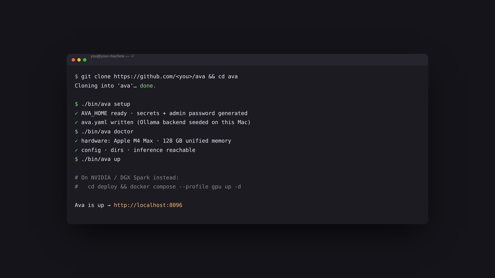

# Installing & running Ava

Ava is **self-hosted and single-tenant**: you run your own instance on your own
hardware, point it at your own models, and connect your own apps. This is step
one of getting started: fork (or clone) the repo, then pick the path for your
machine.

| Your machine | Install path | Verified on device |
|---|---|---|
| Mac mini / Studio (Apple Silicon) | [Bare metal with a native engine](#apple-silicon-mac-mini-studio); Docker can't reach the Apple GPU | :ava-close:{ title="Not verified on device" } |
| NVIDIA GPU box | [Docker, `gpu` profile](#1-docker-recommended) (vLLM) | :ava-close:{ title="Not verified on device" } |
| DGX Spark / unified-memory NVIDIA | [Docker, `gpu` profile](#1-docker-recommended) | :ava-check:{ title="Verified on device" } |
| No GPU | [Docker, `cpu` profile](#1-docker-recommended) (Ollama) | :ava-close:{ title="Not verified on device" } |
| Just an API key | [Docker, `cloud` profile](#1-docker-recommended) | n/a |

**Verified on device** means `hwinfo` has been run on real hardware of that class
and its readings confirmed — not just unit-tested by simulation. A cross means the
detection logic is tested and expected to work, but the numbers are unconfirmed
on that hardware; `n/a` means the path uses no local accelerator. The full matrix,
including what each platform can and cannot report, is in
[Hardware support](../docs/HWINFO_VALIDATION.md).

However you install, verify the wiring afterwards: open **Setup → Hardware** and
Ava should show your machine, detected automatically.

Then continue to step two, [picking Ava's brain](../docs/CHOOSE_A_MODEL.md).

---

## 1. Docker (recommended)

Requires Docker and Docker Compose v2.

The easy path — detects your hardware, picks a profile, resolves your model's
vLLM flags, and waits for the app to actually answer before saying it is done:

```bash
cd deploy && ./install.sh
```

Or pick the profile yourself. Copy it to `.env` and start; the profile selection
lives in the file, so every later `logs` / `down` / `pull` sees the same settings:

```bash
cd deploy
cp profiles/cpu.env   .env   # no GPU  -> Ollama for inference
cp profiles/gpu.env   .env   # NVIDIA GPU -> vLLM
cp profiles/cloud.env .env   # bring an API key, no local model (edit .env first)
cp profiles/full.env  .env   # everything, incl. image/video (the GPU service)
cp profiles/agent.env .env   # + full tool-using agent (opt-in, see below)

docker compose up -d
```

See [profiles/README.md](profiles/README.md) for what each one sets and why the
profile lives in `.env` rather than on the command line.

`install.sh` finishes by printing a **one-time claim link** — open that to create
your admin password.

If you started compose by hand instead, first-run setup is still gated: the
published port arrives through the docker bridge, so the container sees the
gateway address rather than `127.0.0.1` and cannot treat you as local. Read the
token and open the link yourself:

```bash
docker compose exec ava cat /data/data/setup_claim
# then open  http://localhost:8096/setup?claim=<token>
```

Pin `AVA_PASSWORD=...` in `deploy/.env` beforehand to skip the gate entirely.

> **On a Mac (Apple Silicon)?** Skip Docker. Docker Desktop on macOS can't pass
> the Apple GPU through, so inference in a container runs CPU-only. Use the
> bare-metal path below — see [Apple Silicon (Mac mini / Studio)](#apple-silicon-mac-mini-studio).

Good to know:

- **All state lives in one folder** (`AVA_HOME`, default `deploy/ava-data/`):
  config, chats, media, logs, models. To back up, copy that folder.
- **Password**: pin the admin password ahead of time with `AVA_PASSWORD=...` in
  `deploy/.env`; otherwise the first-run screen sets it.
- **Model**: choose one with `AVA_MODEL=...` (gpu profile) or via `ava.yaml`. The
  gpu profile defaults to a small model (`Qwen/Qwen2.5-7B-Instruct`, ~15 GB of
  weights in BF16 — so ~20 GB of VRAM at the default 0.90 memory share, once the
  KV cache is counted); `install.sh` only drops to the cpu profile below 16 GB,
  so on a 16 GB card pick a quantised or smaller model. Scaling up is the
  deliberate act:

  | Variable | Default | Notes |
  |---|---|---|
  | `AVA_MODEL` | `Qwen/Qwen2.5-7B-Instruct` | Any model vLLM can serve. Set it, then re-run `./install.sh` (or `./resolve-model-flags.sh --env <model> >> .env`) so its parsers follow. |
  | `AVA_VLLM_GPU_UTIL` | `0.90` | Fraction of GPU memory vLLM may take. `profiles/full.env` lowers it to `0.55`, where the GPU service shares the pool. |
  | `AVA_VLLM_MAX_LEN` | resolved | Context ceiling, **clamped to what the model actually supports** — vLLM raises rather than clamping, so asking for more than the checkpoint allows means it never boots. |
  | `AVA_VLLM_MODEL_FLAGS` | resolved | `--tool-call-parser`, `--reasoning-parser` and any model-specific boot flags, as one string. |

  You no longer pick a parser by hand. `deploy/model-flags.conf` maps a model to
  its parsers and real context length, and `deploy/resolve-model-flags.sh` is the
  only thing that reads it — `install.sh`, `local-serve.sh` and compose all go
  through it, so the container and bare-metal paths cannot disagree. A parser
  that does not match the model returns no `tool_calls` *silently*, and every
  turn then runs to timeout, so this is the one setting worth getting right.
  An unknown model family serves without tool-calling rather than guessing.
  See [docs/CHOOSE_A_MODEL.md](../docs/CHOOSE_A_MODEL.md).
- **Inference backend**: chat flows bridge → embedded router (`:8010` in-container)
  → the profile's engine. `AVA_BACKEND_URL`/`ENGINE`/`MODEL` come from
  `deploy/profiles/<profile>.env`, which you copy to `deploy/.env`. Compose has
  **no default** for them and refuses to start without them: the bridge runs
  under every profile, so any one default is wrong for the others — the old
  global `http://vllm:8002/v1` pointed the `cpu` profile at a service it never
  started. For `cloud`, `AVA_BACKEND_URL` and `AVA_MODEL` ship empty (`ENGINE` is
  already `openai`), as does `AVA_INFERENCE_KEY` — which is *not* start-guarded,
  so an empty key starts cleanly and fails on the first turn instead.
- **Agent**: the container runs the tool-less assistant by default. For the
  **full tool-using agent** (self-coding, connectors, memory) in Docker, opt into
  the `agent` profile: `cp profiles/agent.env .env && docker compose up -d`
  (that file already sets the `AVA_AGENT_ENABLED` / `AVA_AGENT_RUNTIME` /
  `AVA_ROUTER_HOST` trio, which all three have to be right together). This
  runs a separate agent container that mounts the host Docker socket, which is
  **root-equivalent** on the host; it is opt-in for that reason. Full setup and
  the security caveat: [AGENT_RUNTIME.md, Full agent in Docker](../docs/AGENT_RUNTIME.md).

### Verified install (recommended)

Published images are **cosign-signed** (Sigstore keyless; the signature proves
the image came from this repo's release CI). Pull the signed image instead of
building locally by setting `AVA_IMAGE` in `deploy/.env`, and verify it first:

Replace `<version>` below with a tag that exists — see the repository's Releases
page. (`release.yml` publishes an image only on a `v*` tag push, so a tag that has
not been released yet returns 403 from GHCR.)

```bash
# Verify the release image (see SECURITY.md §9 for the exact identity regex):
cosign verify ghcr.io/<owner>/ava-bridge:<version> \
  --certificate-identity-regexp "https://github.com/<owner>/.+/.github/workflows/release.yml@refs/tags/<version>" \
  --certificate-oidc-issuer https://token.actions.githubusercontent.com

echo "AVA_IMAGE=ghcr.io/<owner>/ava-bridge:<version>" >> deploy/.env
docker compose pull && docker compose up -d
```

One-line install on a fresh box (auto-detects GPU/CPU). Run it from inside your
clone, or point `AVA_REPO` at your fork:

```bash
git clone https://github.com/<you>/ava && cd ava/deploy && ./install.sh
# or standalone (replace `master` with your fork's default branch or a release tag):
AVA_REPO=https://github.com/<you>/ava.git bash -c "$(curl -fsSL https://raw.githubusercontent.com/<you>/ava/master/deploy/install.sh)"
```

> **Note:** `ollama`/`vllm`/`gpu-service` are upstream images (override `gpu-service`
> with `AVA_GPU_SERVICEUI_IMAGE`). The `ava/bridge` image is built locally by default,
> or set `AVA_IMAGE` to the signed published image (above). Model weights
> download on first run and carry their own licenses (surfaced at setup).

---

## 2. Bare metal with the `ava` CLI

If you would rather run it directly (for example, you already have Python and a
GPU stack):

```bash
python -m venv .venv && . .venv/bin/activate
pip install -r requirements.txt
cd frontend && npm install && npm run build && cd ..

./bin/ava setup      # creates AVA_HOME, generates secrets + admin password, ava.yaml
./bin/ava doctor     # verifies hardware, dirs, config, inference, services
./bin/ava up         # runs the web app on http://localhost:8096
```

`ava setup` prints your generated admin password (or pass `--password`).

`./bin/ava` works from the checkout with no install step. To get a plain `ava`
command on your `PATH` instead, swap the `pip install -r requirements.txt` line
for `pip install -e .` — it installs the same dependencies and adds the console
script. Keep the `-e`: Ava runs *from* this checkout, and a non-editable install
would leave it looking for `frontend/dist`, `config.example.yaml` and
`agent/install.sh` inside `site-packages`, where they are not.

A healthy run looks like this — `doctor` shows the hardware it detected, and
`up` prints the address to open:



The same install end to end, narrated (sound on):

<video controls playsinline preload="metadata"
       style="width:100%;border-radius:8px"
       aria-label="Screen recording: installing Ava from a terminal, through setup, doctor, and up, then opening the web app">
  <source src="../docs/assets/install-tour.mp4" type="video/mp4">
  Your browser can't play video. <a href="../docs/assets/install-tour.mp4">Download the walkthrough</a>.
</video>

### Inference on bare metal

Chat flows **bridge → router → your engine**. The OpenAI-compatible router
starts **inside `ava up` automatically** (embedded, `127.0.0.1:8010`), so you
never need a second service. An always-on standalone unit
(`uvicorn ava_router:app --host 127.0.0.1 --port 8010`) is detected at startup
and used instead. Declare your engine in `ava.yaml`:

```yaml
inference:
  primary: local
  backends:
    local:
      engine: ollama                      # vllm | ollama | llamacpp | openai
      base_url: http://127.0.0.1:11434/v1
      model: llama3.2
```

`ava models pull --auto` downloads a model sized to your hardware and prints
this stanza for you. `ava doctor` checks the route chat *actually* uses.

**Tool calling per engine** (matters for the full agent; plain chat works
regardless):

| Engine | Tool calls | Launch requirement |
|---|---|---|
| vLLM | native | `--enable-auto-tool-choice --tool-call-parser <parser for your model>` (both are required; wrong parser = tools silently return as prose) |
| Ollama | native | none (tool-capable models only) |
| llama.cpp | opt-in | `llama-server --jinja` with a tool-call chat template; otherwise declare `tools: none` on the backend |
| cloud (openai) | native | none |

**Exposing the router beyond localhost**: set `inference.router.host: 0.0.0.0`.
Every `/v1/*` call then requires the router token
(`$AVA_HOME/secrets/router_token`) as a `Bearer` / `X-Ava-Router-Token`
header. Loopback (the default) needs no token for `/v1/*`.

### Apple Silicon (Mac mini / Studio)

A Mac is **unified-memory** hardware: CPU and GPU share one RAM pool and there is
no `nvidia-smi`. **Ava does not serve vLLM on a Mac** — upstream macOS support is
experimental, build-from-source and CPU-only unless you add the community
`vllm-metal` plugin. Run bare metal with a native engine (Ollama, llama.cpp, MLX,
LM Studio) so inference uses the Metal GPU. The hardware layer detects
Apple Silicon automatically and gates model routing on the shared RAM pool (a
512 GB Studio runs a 70B comfortably; a 24 GB mini should stay ~8B).

```bash
python3 -m venv .venv && . .venv/bin/activate
pip install -r requirements.txt              # no CUDA/vLLM wheels; clean on arm64

# a native, OpenAI-compatible engine (any of these work; Ollama shown):
brew install ollama && ollama serve &
ollama pull llama3.1:70b                      # sized to YOUR Mac's memory

./bin/ava setup      # on a Mac this seeds an Ollama backend, not the vLLM default
./bin/ava doctor     # confirms it detects Apple Silicon + the right memory tier
./bin/ava up         # http://localhost:8096
```

Notes:
- **`ava models pull --auto` is Apple-aware** — on a Mac it fetches an Ollama
  model sized to your memory, never the CUDA-only vLLM default
  (`Qwen/Qwen2.5-7B-Instruct`), which cannot be served on Apple Silicon.
- LM Studio and MLX also work — point the backend `base_url` at their
  OpenAI-compatible endpoint (see the Apple example in
  [`config.example.yaml`](../config.example.yaml)).
- GPU **memory** shows in the dashboard; util/temp/power read blank on Apple
  (no unprivileged API) — that's expected, not a fault.

---

## 3. Configuration

Everything is driven by **`$AVA_HOME/ava.yaml`** (copied from
[`config.example.yaml`](../config.example.yaml) by `ava setup`) plus environment
overrides. **No source edits, ever.** Highlights:

| Setting | What it does |
|---|---|
| `server.port` | web app port (default 8096); env `AVA_PORT` |
| `inference.backends` | your model engines (vLLM / Ollama / llama.cpp / cloud) |
| `agent.sandbox` | the agent runtime sandbox name |
| `features.*` | `image`, `web_search`, `voice` (Setup → System → Optional features), plus `learning` and `memory`, which have their own panels |
| `connectors` | the apps Ava monitors and drives |

Secrets live outside `ava.yaml` and outside the repo: the admin password in
`$AVA_HOME/data/auth_password`, the session signing key in
`$AVA_HOME/data/.secret`, the router token and cloud API key under
`$AVA_HOME/secrets/` — or supply any of them by env (`AVA_PASSWORD`,
`AVA_SECRET`, `AVA_ROUTER_TOKEN`, `AVA_INFERENCE_KEY`). Full inventory:
[SECURITY.md §4](../SECURITY.md).

---

## 4. Connecting your own apps

Wire your apps into Ava from the browser (**Setup → Connectors → Connect an
app**: paste an address, click Detect, done) or from the CLI with a connector
manifest. The step-by-step guide, with screenshots and a video of the whole
flow, is [Connect your apps](../docs/CONNECT_YOUR_APPS.md); the full manifest
reference is the [Connector SDK](../docs/CONNECTOR_SDK.md).

---

## Troubleshooting

- `ava doctor` is the first stop; it shows what's missing.
- Health check: `curl http://localhost:8096/api/health`.
- Docker logs: `docker compose logs -f ava`.
- No GPU? `cd deploy && cp profiles/cpu.env .env` (Ollama) or
  `cp profiles/cloud.env .env` (an API key), then `docker compose up -d`. The
  profile lives in `.env`, never as `--profile` on the command line.
