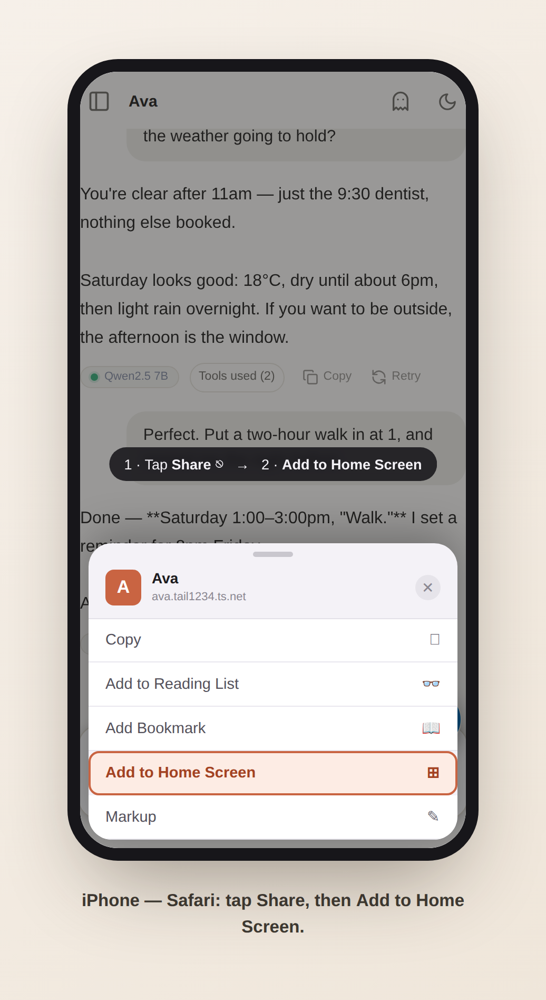
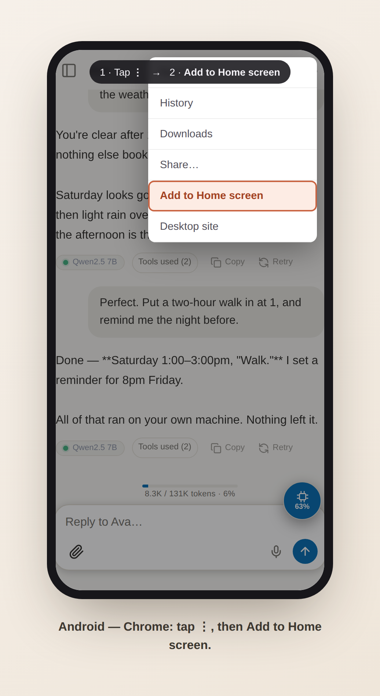

# Ava on your phone (PWA)

Ava's web app is an installable Progressive Web App: add it to your home
screen and it opens full-screen with its own icon, like a native app. The
same responsive UI serves desktop and mobile — there is no separate app to
install or keep updated. New frontend builds are picked up automatically the
next time the app is opened.

## Install

1. Open your Ava URL in the phone's browser and log in.
2. **iOS (Safari):** Share → *Add to Home Screen*.
   **Android (Chrome):** the install prompt appears automatically, or
   ⋮ menu → *Add to Home screen*.

| iPhone | Android |
|---|---|
|  |  |

## HTTPS is required for the full experience

Browsers only enable service workers (the offline app shell, install prompts
on Android) in a *secure context* — `https://` or `http://localhost`. Over
plain HTTP on your LAN (`http://192.168.x.x:8096`) the app still works and
can still be pinned to the home screen, but without the installed-app shell.

The zero-config way to get HTTPS for a self-hosted Ava is
[Tailscale](https://tailscale.com):

```sh
tailscale serve --bg 8096
```

That publishes the bridge inside your tailnet at
`https://<host>.<tailnet>.ts.net` with a valid certificate — no port
forwarding, no certificate management, and nothing exposed to the public
internet. Open that URL on any device in your tailnet and install from
there. Any other reverse proxy that terminates TLS (Caddy, nginx +
Let's Encrypt) works the same way.

## What is (and isn't) cached offline

The service worker precaches only the **app shell** — the HTML, JS, CSS and
icons. Everything live (chat turns, `/api/*`, media, uploads, connector
apps) is network-only and never served stale. Offline, the app opens but
Ava herself is unreachable, exactly as you'd expect.

## Scope

This is the governed-cockpit surface on mobile: chat, dashboards, the Data
page (browse/export everything Ava stores), and the Setup hub. Voice capture
uses the browser microphone (also secure-context-gated). There are no push
notifications yet.
