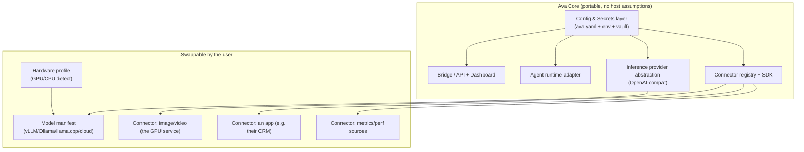

# Ava — Productization & Packaging Plan

> **Status:** Living design document · **v0.2** · 2026-07-04
> **Goal:** evolve Ava from a single-user, host-coupled personal build into an
> **easy, plug-and-play, self-hosted product** others can install on their own
> hardware and connect to their own apps — without a rewrite, by refactoring
> deliberately as we keep building.

---

## 0. Decisions locked (2026-07-04)

| Decision | Choice |
|---|---|
| **Product shape** | **Single-tenant, self-hosted** — each user runs their own Ava on their own hardware (not multi-tenant SaaS). |
| **License** | **Apache-2.0** (permissive + explicit patent grant). MIT is the fallback if we want maximum simplicity. |
| **Distribution (primary)** | **Docker Compose** with `gpu` / `cpu` / `cloud` / `full` profiles + a one-line installer. |
| **Refactor style** | **Incremental** — decouple as we build; no big-bang rewrite. Phase 0/1 must also improve the current personal setup. |
| **This document** | Living doc, iterated together. |

---

## 1. Product vision & shape

**What Ava becomes:** a self-hosted "personal AI operations hub" — chat + voice +
GPU workloads + app automation + a Command Center dashboard — that a
technical-ish user installs on **their own machine/GPU**, points at **their own
models**, and connects to **their own apps** via connectors.

**Chosen shape (LOCKED, §0): single-tenant, self-hosted.**
- Each user runs **their own** Ava instance on their hardware (privacy, BYO GPU,
  no cloud bills for us, matches the current design).
- **Not** multi-tenant SaaS (v1). That's a much larger security/ops surface and
  conflicts with "use their own hardware." Keep the door open (see §11) but don't
  build for it now.

**North-star install experience (the bar to hit — the `get.ava.sh` domain is not
registered yet; today the real path is `docker compose up`, see deploy/README.md):**
```
curl -fsSL https://get.ava.sh | sh      # PLANNED — today: docker compose up
# → detects hardware → pulls a model tier → opens http://localhost:8096
# → first-run wizard: set password, pick model, (optionally) add connectors
# → you're chatting in <10 minutes, zero source edits
```

---

### 1a. Positioning & competitive landscape

**One-line positioning (the "X for Y"):**
> **Ava is a self-hosted personal AI operating layer** — a private, plug-and-play
> hub that puts *any* model to work across your voice, your apps, and your creative
> tools, on your own hardware, and keeps improving itself.

**Shorter variants**
- *Tagline:* "Your private AI: self-hosted, on your hardware, wired to your world."
- *One-liner:* "One self-hosted hub for chat, voice, GPU workloads, and app
  automation — behind a single dashboard, running on your own GPU."
- *Category:* a **personal AI operating layer** (not a chatbot, not a model).

**Who it's for:** privacy-conscious technical prosumers, tinkerers, and small teams
who want an always-on AI that runs on their **own** hardware, connects to their
**own** apps, and isn't locked to a single cloud vendor.

**The moat (why it's differentiated):** the *combination* under one private roof —
integration breadth + on-device privacy + observability + self-improvement +
model-agnostic + plug-and-play. Almost nothing else does all of these at once.

**What Ava is deliberately NOT:** a foundation model, a cloud SaaS, or a
frontier-capability chatbot. It **orchestrates** intelligence; it doesn't produce
it — its "IQ" is whatever model you plug in.

**Competitive scorecard:** the canonical, up-to-date comparison (including the
NemoClaw/OpenClaw column) lives in the [README](../README.md#where-it-stands) —
read it there rather than duplicating a table that drifts.

**Read of it:** Ava is the only column that's Strong across voice + generation
+ agent + self-improvement + connectors + observability + governance *together*,
self-hosted. The trade-off is honest: it trails the cloud incumbents on raw model
IQ, polish, and mobile/scale — because those aren't its job. It's the **control
layer**, not the brain.

> A polished, public-facing version of this positioning (hero + comparison) is the
> project's top-level [README.md](../README.md) — the landing page for launch.

---

## 2. Guiding principles (adopt these NOW while building for yourself)

These are cheap to follow today and save a painful rewrite later:

1. **Config over hardcode.** No literal paths, IPs, ports, hostnames, sandbox
   names, or model ids in code. Everything resolves from a config layer (§5.1).
2. **`AVA_HOME` everything.** One data root; never assume `/home/<user>/projects/Ava`.
3. **Connectors, not `if myapp:`** Every external app integration goes through
   the connector interface (§5.3), never bespoke wiring in the core.
4. **Backend-agnostic inference.** Talk to an OpenAI-compatible provider abstraction,
   never a specific engine/port (§5.2).
5. **Secure by default.** Generated secrets, least-privilege, no personal data in
   the repo, opt-in telemetry.
6. **Feature-flag the personal bits.** Voiceprint gate, your specific apps, your
   Tailscale — all optional modules, off by default.

> Practical rule: when you add a new path/port/secret/integration for *yourself*,
> add it to config/connector scaffolding at the same time. That's the whole trick.

---

## 3. Current host-coupling inventory (the debt to unwind)

Grounded in a scan of the repo — this is exactly what blocks portability today:

| Coupling | Where | Fix |
|---|---|---|
| Hardcoded `/home/<user>/...` | ~10 files: `ava_bridge/{policy,config,log,learning}_mgmt.py`, `ava_learning_{digest,weekly}.py`, `agent/mcp_server_productivity/email/*`, `agent/docs/architecture.yaml`, `gpusvc/extra_model_paths.yaml` | `AVA_HOME`/config-derived paths |
| Tailscale IP (host-specific) | `agent/mcp_server_admin/debug/{read_logs,read_performance}.mjs` | connector/env: bridge base URL |
| Sandbox name `my-assistant` | 4 refs (config default + tools) | config `agent.sandbox` |
| ~37 hardcoded port literals | across `*.py` (mostly env-defaulted, still literal) | central `ports`/`services` config |
| Sibling apps (your own apps) | `ava_bridge/config.py`, dashboard `MONITORED_SERVICES`, `perf_mgmt.SOURCES` | first-party **connectors** (§5.3) |
| Personal auth model | single `AVA_PASSWORD`, biometric `voiceprint.npy` | pluggable auth; voiceprint = optional module |
| Agent runtime | OpenClaw/`nemoclaw` sandbox, vLLM on fixed ports | bundled/abstracted runtime (§5.4) |
| systemd **user** units | `ava-*.service/.timer` assume this user/host | generated by installer or replaced by container supervisor |

Good news already in place: `config.py` uses `os.environ.get(...)` + `expanduser`
for many knobs, `.env.example` exists, the perf logs are env-configurable, and the
router is already an OpenAI-compatible proxy — solid seeds for the abstraction.

---

## 4. Target architecture (portable)



### 5.1 Config & secrets layer *(foundational — do first)*
- **`AVA_HOME`** (default `~/.ava` or `/data` in containers) = the single root for
  config, data, logs, media, models. Replaces every hardcoded home path.
- **Layered resolution:** built-in defaults → `AVA_HOME/ava.yaml` → env vars →
  secrets store. One typed accessor (`config.get("inference.base_url")`), like we
  did for the frontend `tokens.css` SSOT.
- **Secrets:** generated on first run into `AVA_HOME/secrets/` (0600) or an env/
  OS-keychain; never in the repo. `AVA_PASSWORD`, HMAC key, API keys, connector creds.
- **Deliverable:** `ava_bridge/settings.py` (schema + loader) replacing the ad-hoc
  `config.py` constants; a `config.example.yaml`.

**Example `AVA_HOME/ava.yaml` (what replaces the hardcoded constants):**
```yaml
ava_home: ~/.ava            # data root (env AVA_HOME wins)
server:
  host: 0.0.0.0
  port: 8096
  public_url: http://localhost:8096   # was the hardcoded Tailscale IP
auth:
  mode: password            # password | oidc | none(dev)
  # secret + password come from the secrets store, never here
inference:
  primary: local
  backends:                 # see §5.2 — declared, not hardcoded ports
    local:  { engine: vllm, base_url: http://127.0.0.1:8002/v1, model: Qwen/Qwen2.5-7B-Instruct }
agent:
  runtime: openclaw
  sandbox: my-assistant     # was hardcoded in 4 places
features:
  voice: false              # personal modules default OFF
  voiceprint: false
connectors: [gpu-service]   # §5.3 — enabled connectors
```

### 5.2 Inference provider abstraction *(BYO models/hardware)*
- Keep `ava_router.py` as the stable OpenAI-compatible control point for the
  local open-model vLLM backend. Conversational inference stays local; cloud Claude
  usage is reserved for code mode.
- **Hardware detection** (`ava doctor`): detect GPU/VRAM/CPU/RAM → recommend a
  **local model tier** for non-DGX installs without adding a cloud fallback path.
- **Model manifest:** `models.yaml` maps logical roles (`chat`, `fast`, `embed`,
  `image`, `video`) → concrete models/engines, so the app never names a model
  inline. Installer can pull the right tier.

### 5.3 Connector / plugin system *("connect their many different apps")*
This is the biggest product unlock. Replace any hardcoded per-app wiring
with a **manifest-driven connector model**:
```
AVA_HOME/connectors/<name>/
  connector.yaml     # id, label, health probe, routes, perf log path, egress policy
  adapter.py|.mjs    # implements the connector interface (health, actions, metrics)
```
- **Registry** loads enabled connectors at boot; the bridge exposes them uniformly
  (dashboard service matrix, perf sources, MCP tools, egress policies all become
  *derived from connector manifests* instead of hardcoded lists).
- **First-party connectors** (dogfood the SDK): `gpu-service` (image/video) ships in
  core; your own apps become drop-in connectors, not core code.
- **Connector SDK + template** so a user scaffolds `ava connector new mycrm` and
  fills in health/actions/auth. Ship 2–3 examples + docs.
- Ties directly into the dashboard we built: `MONITORED_SERVICES`, `perf_mgmt.
  SOURCES`, and the ops/services matrix all read the connector registry.

**Example `connectors/gpu-service/connector.yaml`:**
```yaml
id: gpu-service
label: the GPU service (image/video)
kind: media
health:
  probe: http://127.0.0.1:8189/        # dashboard service-matrix reads this
perf_log: ${AVA_HOME}/logs/performance.jsonl   # dashboard perf source
egress:                                 # what the agent may reach for this connector
  - { host: 127.0.0.1, port: 8189 }
actions:                                # surfaced to the agent as MCP tools
  - id: run_gpu_job
    handler: adapter.run_gpu_job
```

**Connector interface (Python adapter):**
```python
class Connector:
    def health(self) -> dict: ...          # {status: up|down, detail}
    def metrics(self) -> list[dict]: ...   # rows for the dashboard
    def actions(self) -> list[Action]: ... # exposed as agent tools
```
The registry aggregates every enabled connector's `health()`/`metrics()`/`actions()`
so the dashboard, perf log, egress policy, and agent tools are all *derived*, never
hand-maintained.

### 5.4 Agent runtime adapter
- OpenClaw/`nemoclaw` (the MCP host + sandbox) is a hard dependency today. Wrap it
  behind an **`AgentRuntime` interface** (`run_turn`, `session`, `list_tools`) so
  it can be (a) bundled+auto-provisioned by the installer, or (b) swapped for
  another MCP host later. Sandbox name/agent id come from config.

### 5.5 Auth & identity
- Keep **single-user per instance** for v1 but behind a pluggable auth interface
  (password now; OIDC/passkeys later). Biometric voiceprint = **optional module**,
  disabled unless the user enrolls. Clear "first-run sets the password" flow.

### 5.6 Storage & data
- All runtime data under `AVA_HOME` (chats, media, logs, models, secrets). Explicit
  data-dir so backup/restore/migrate is one folder. Pluggable stores later (SQLite
  default; Postgres optional for heavier connectors).

---

## 6. Packaging & distribution

**Primary: Docker Compose** (best fit for GPU + multi-service):
- Services: `ava-bridge`, `ava-router`, `agent-runtime`, optional `inference`
  (vLLM/Ollama), optional `gpu-service`, optional `searxng`. GPU via NVIDIA runtime;
  CPU-only profile for no-GPU users (routes to Ollama/cloud).
- **Profiles**: `--profile gpu | cpu | cloud | full` so users pick their setup.
- One bind-mounted `AVA_HOME` volume = all state.

**Secondary (planned): one-line install script** (`get.ava.sh` — domain not yet
registered) that installs Docker if needed, writes `AVA_HOME`, runs compose,
opens the wizard.

**Example compose shape (profiles let users pick their setup):**
```yaml
services:
  ava-bridge:   { image: ava/bridge,  volumes: ["${AVA_HOME}:/data"], ports: ["8096:8096"] }
  ava-router:   { image: ava/router }
  agent:        { image: ava/agent-runtime }
  inference:    { image: vllm/vllm-openai, profiles: [gpu], deploy: { resources: { reservations: { devices: [{ capabilities: [gpu] }] } } } }
  ollama:       { image: ollama/ollama, profiles: [cpu] }        # no-GPU path
  gpu-service:      { image: ava/gpu-service, profiles: [full] }
# `docker compose --profile gpu up`  |  `--profile cpu`  |  `--profile cloud`
```

**Later: desktop wrapper** (Tauri/Electron) around the local web app for
non-terminal users; **native packages** (deb/brew) optional.

---

## 7. First-run onboarding wizard
Web-based, served by the bridge on first boot (no config yet):
1. Set admin password.
2. Hardware check + recommended model tier (with "download now" or "use cloud key").
3. Pick inference backend (local engine vs. cloud key).
4. Optional: enable image/video (the GPU service), voice, web search.
5. Optional: add connectors (browse catalog → provide creds → health check).
6. Done → redirect to the dashboard.

Everything the wizard sets writes to `AVA_HOME/ava.yaml` — no source edits, ever.

---

## 8. Security & privacy hardening (required for public)
- Generated secrets; secure cookies; rate-limited auth (already have a throttle).
- **Connector egress policies** derived from manifests (Ava already has an egress-
  policy model — generalize it so a connector declares exactly what it may reach).
- SSRF guards on any user-provided URLs (web layer already does this — reuse).
- Sandbox the agent's tool execution (OpenClaw already isolates — keep, document).
- No telemetry without **explicit opt-in**; if on, anonymous + documented.
- Supply-chain: pin deps, SBOM, signed releases/images.
- A `SECURITY.md` threat model + responsible-disclosure (partly exists).

---

## 9. Repo & code structure refactor
Move toward a clean monorepo so "core" is shippable and personal bits are optional:
```
ava/
  core/            # bridge, router, agent adapter, config, connector registry
  connectors/      # first-party connectors (gpu-service, …) + SDK
  web/             # the React SPA (Vitals/Operations/Data/Chat)
  agent/           # MCP server + skills + policies (manifest-generated where possible)
  deploy/          # docker-compose, install.sh, profiles, systemd (generated)
  packages/        # optional: voice, biometric, tailscale — off by default
  docs/            # install, connectors SDK, model tiers, security
  examples/        # sample connectors + configs
```
- **Tests + CI** (currently thin): unit tests for config/connectors/provider;
  a smoke test that boots the stack CPU-only and hits `/api/health`; lint/typecheck
  gates; build the web bundle. This is what makes refactors safe.
- Keep the existing `arch.py` SSOT idea — extend it to validate connectors + config.

---

## 10. Updates, licensing, docs, community
- **Versioning + migrations:** semver; a `migrations/` for `ava.yaml`/data schema;
  `ava update` pulls new images and runs migrations.
- **License:** **Apache-2.0** (LOCKED, §0) — permissive for adoption plus an
  explicit patent grant that protects users and contributors; MIT is the fallback
  if we ever want maximum simplicity. Deliverables: a root `LICENSE`, SPDX headers
  (`# SPDX-License-Identifier: Apache-2.0`) on source files, a `NOTICE` file, and
  **DCO sign-off** (`Signed-off-by`) on contributions rather than a heavyweight CLA.
  Vet third-party/model licenses separately (bundled models/checkpoints have their
  own terms — surface these in the installer).
- **Docs site:** install guides per platform, model-tier matrix, connector SDK,
  troubleshooting, `ava doctor`.
- **Community:** connector catalog/registry, example connectors, contribution guide.

---

## 11. Phased roadmap (incremental, no big-bang rewrite)

**Phase 0 — Decouple (do continuously, starting now)**
- [x] Introduce `AVA_HOME` + `ava_bridge/settings.py` (layered config + secrets);
      `config.py` data dirs now resolve under `AVA_HOME` (default = repo root, so
      the personal install is unchanged). `config.example.yaml` added.
- [x] Migrate the remaining ~10 hardcoded-path files + the Tailscale IP / sandbox
      name literals onto `settings`/config. **Done** — and now enforced rather
      than remembered: `tests/test_path_roots.py` fails any module that resolves
      `AVA_HOME` itself or hangs runtime state off the code root, and
      `tests/test_no_owner_identity.py` fails any tracked file carrying an
      absolute home path or a CGNAT address. This box stayed unticked long after
      the work landed, which understated the project to every contributor
      CLAUDE.md sends here. If a box below looks stale the same way, the guard
      tests are the cheaper source of truth.
- [x] Rule adopted: every new path/port/secret goes through config from now on.

**Phase 1 — Configurable single box**
- [ ] All services/ports/apps declared in `ava.yaml`; nothing personal in code.
- [x] `ava doctor` (hardware + dirs + config + inference + service health).
- [x] Secrets auto-generated (`ava setup`); `.env` optional.

**Phase 2 — Connector SDK**  *(see [CONNECTOR_SDK.md](CONNECTOR_SDK.md))*
- [x] Connector registry + interface; `gpu-service` is a connector; personal apps
      migrated onto the generic proxy (discovery + declared
      actions + browser data-proxy); their bespoke bridge routes/clients removed.
- [x] Dashboard service-matrix / perf-sources / egress policies read the registry.
- [x] **Data-driven app surface**: `ui:` manifest block + `/api/apps` + the left
      rail/views render from the registry (native / iframe / none embed tiers).
      A third-party app appears by dropping a folder — no frontend edits.
- [x] `ava connector new` template + example third-party connector
      ([examples/hello-app](../examples/hello-app/)).

**Phase 3 — Inference & hardware abstraction**
- [x] Provider layer (vLLM/Ollama/llama.cpp/cloud): `ava_bridge/router_app.py`
      app factory with per-backend `engine`/`tools` flags + minimal engine
      adapters; the **router is embedded in the bridge** (`router_host.py`,
      auto-detects a standalone unit) so bare-metal and Docker share one path;
      `/v1/*` auth-hardened (loopback default, bearer when LAN-exposed). Roles
      live in `ava.yaml` `inference.roles` (decision: **extend ava.yaml, no
      separate `models.yaml`**).
- [x] Hardware-tier recommendation (`model_fit.recommend_tier`, shared by
      doctor/wizard/CLI) + `ava models pull --auto` with an emitted config stanza.

**Phase 4 — Packaging & onboarding**
- [x] Docker Compose profiles (`gpu`/`cpu`/`cloud`/`full`) + `Dockerfile` +
      one-line `deploy/install.sh` + `deploy/README.md` (scaffolded).
- [x] `ava setup` writes `ava.yaml` + generates password/secrets (CLI first-run).
- [x] First-run **web** wizard (`/setup/wizard`): password → hardware+tier →
      backend pick → optional features → connector catalog, all written to
      `ava.yaml` via `settings.save_patch`. Server-rendered (no SPA dependency).
- [ ] Agent runtime bundled/auto-provisioned into the images.

**Phase 5 — Public beta**
- [x] Security hardening (router `/v1` auth, security-surface test suite:
      auth middleware / SSRF guard / token scoping / connector registry) + CI/CD
      (`.github/workflows/ci.yml`: ruff, pytest, dist-drift, CPU smoke boot,
      gitleaks).
- [ ] Telemetry opt-in, docs site, signed releases. Private beta → public.

---

## 12. What to change starting with the *next* feature
So we stop adding debt while still building for you:
- New integration? → make it a **connector** (even a thin one), not core wiring.
- New path? → under `AVA_HOME`. New port/URL? → `ava.yaml`. New secret? → secrets store.
- New service to monitor? → add it to the connector manifest, and the dashboard
  picks it up automatically (no `MONITORED_SERVICES` edits).
- Personal-only feature (voiceprint, your apps)? → optional module, flag-gated off.

---

## 13. Risks & open questions
- **Agent runtime portability** — OpenClaw/nemoclaw is the deepest coupling; bundling
  vs. abstracting is the biggest unknown. Prototype the `AgentRuntime` adapter early.
- **GPU/driver variance** across users' machines — the CPU/cloud profile is the
  safety net; document supported GPUs.
- **Scope creep vs. your daily use** — keep Phase 0/1 refactors non-disruptive; they
  should make *your* setup cleaner too, not slower.
- **Open:** license model? hosted option ever? connector security review process?
  bundle inference or require the user to bring it?

---

## 14. Changelog
- **v0.5 (2026-07-06)** — major productization build-out landed (see CHANGELOG
  `[2026-07-06]`): **Connector/App SDK** — `ui:` manifest block + `/api/apps` +
  data-driven left rail (native/iframe/none embed tiers), same-origin app proxies,
  dynamic tool discovery, `examples/hello-app`, `docs/CONNECTOR_SDK.md`; **Phase 2
  connector items now done** (§11). **Pluggable agent runtime** — `AgentRuntime`
  interface (`ava_bridge/runtime/`) with NemoClaw default + Direct fallback,
  `agent.required` gate, `ava agent provision/status`, `docs/AGENT_RUNTIME.md`
  (partially addresses §5.4). **Fork-readiness** — first-run web `/setup`, degraded
  chat so a fresh fork works with no runtime, `ava.yaml` now drives the running
  bridge, model switcher + `/api/brand` + de-DGX hardware UI, `ava doctor` tier
  recommendation, and de-personalization (§3 debt largely cleared). Personal apps
  migrated onto the generic connector proxy; agent switched to open-model 30B.
- **v0.4 (2026-07-04)** — added §1a Positioning & competitive landscape (one-line
  positioning + variants, target user, moat, "what it's NOT", and an honest
  Ava-vs-Open WebUI/OpenHands/Home Assistant/cloud scorecard).
- **v0.3 (2026-07-04)** — first build-out landed (non-breaking): `settings.py`
  (`AVA_HOME` + layered config + secrets), `config.example.yaml`, `ava` CLI
  (`doctor`/`setup`/`up`), Docker packaging (`deploy/` Dockerfile + compose
  profiles + install.sh + guide), Apache-2.0 `LICENSE` + `NOTICE`, README
  Quickstart. Live personal instance verified unchanged.
- **v0.2 (2026-07-04)** — locked decisions (§0): single-tenant self-hosted +
  Apache-2.0 license; fleshed out config (`ava.yaml`), connector (`connector.yaml`
  + interface), and compose examples; added license deliverables (LICENSE/SPDX/
  NOTICE/DCO).
- **v0.1 (2026-07-04)** — initial packaging/productization plan; coupling inventory,
  target architecture (config/inference/connector/agent abstractions), Docker-first
  packaging, onboarding wizard, 6-phase incremental roadmap.
