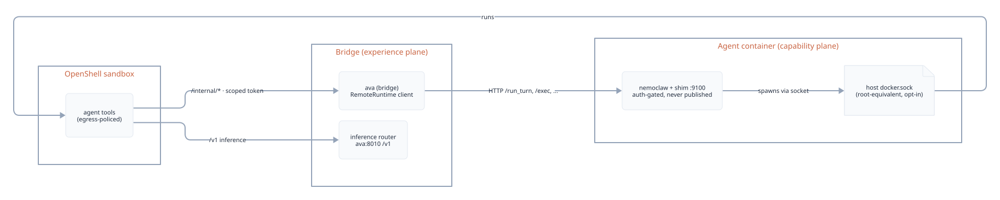

# The agent: tools, skills & self-improvement

Ava's tools, skills, chain of thought and persistent memory all come from an
**agent runtime** — a sandboxed process that Ava talks to through one
interface. What makes it interesting is not that it runs tools. It is what
happens around it: the runtime is pluggable and degrades honestly, everything
it can reach is enumerated and capability-scoped, and both of Ava's
self-improvement loops **park their output for you** instead of applying it.

Setup instructions live on [Set up the agent](../AGENT_RUNTIME.md). This page
is about what the agent *is* and what it is allowed to do.

---

## A pluggable seam with three real implementations

`ava_bridge/runtime/` defines one `AgentRuntime` interface (`available()`,
`run_turn()`, plus optional `exec` / `session_file` / `provision` / `status`)
and a registry keyed by the `agent.runtime` setting. Three implementations
ship:

| `agent.runtime` | What runs | Tools | Live CoT |
|---|---|:--:|:--:|
| `nemoclaw` *(default, alias `openclaw`)* | [NemoClaw](https://github.com/NVIDIA/NemoClaw) (NVIDIA, Apache-2.0) running OpenClaw inside an OpenShell sandbox, driven in-process by the bridge | Yes | Yes |
| `remote` | The Docker split: a separate **agent** container owns the `nemoclaw` CLI and the Docker socket, and the bridge drives it over HTTP | Yes | Yes |
| `direct` *(alias `none`)* | The explicit tool-less floor — an OpenAI-compatible call to Ava's inference router with recent history replayed for continuity | No | No |

`remote` is a faithful network mirror, not a reimplementation: the agent
container runs `ava_bridge/agent_runtime_server.py`, a shim that wraps the
*same* `NemoClawRuntime`. Every route on that shim except `/healthz` is
rejected with `401` unless it carries `X-Ava-Agent-Token`, compared with
`hmac.compare_digest` against the shared secret both containers mount. The
bridge's side probes `/healthz` and treats the runtime as available only when
it answers `ready: true` — the container's entrypoint onboards the sandbox
before that flips, so a half-provisioned agent never gets traffic.

[](../assets/agent-remote-runtime.svg)

Adding a fourth is a file: implement the interface in
`ava_bridge/runtime/<name>.py`, register it, select it with
`agent.runtime: <name>`. Ava's core only ever talks to the interface.

### Resolution is honest about degradation

Two functions do the work, and the difference between them is the whole
policy:

- **`configured()`** returns what you asked for — the registry entry for
  `agent.runtime`, defaulting to `nemoclaw`.
- **`active()`** returns what will actually serve the turn: the configured
  runtime if `available()`, otherwise the Direct floor.

`gate()` layers `agent.required` on top. When the configured runtime is
missing and `agent.required: true`, it returns an explicit error string —
and the turn path raises it rather than quietly serving a tool-less reply
that looks like a normal answer:

```
The agent runtime (NemoClaw) is required but isn't available. Provision it
with `ava agent provision --install`, or set `agent.required: false` in
ava.yaml to allow tool-less direct chat.
```

The availability probe itself is deliberately strict. `NemoClawRuntime`
reports available only when the agent is enabled in config **and** the CLI
resolves on disk **and** the sandbox exists — result cached ~30 s, so an
install or an `onboard` is picked up within half a minute. An
*indeterminate* probe (timeout, CLI error) counts as **unavailable** on
purpose. That reads backwards for a codebase whose usual instinct is
"degrade, never brick", and the reason is in the source: here the graceful
degradation *is* Direct. Checking only the CLI once made `active()` pick
NemoClaw with no sandbox behind it, so every turn burned the full tool
timeout and returned a canned failure. A working tool-less assistant beats a
runtime that takes two minutes to fail.

```yaml
agent:
  runtime: nemoclaw       # nemoclaw | openclaw | remote | direct | none
  required: false         # true -> a missing runtime is a loud error
  enabled: true           # false -> force the Direct floor
  sandbox: my-assistant
  agent_id: main
```

`ava agent status` prints the same resolution from a terminal; **Setup →
Agent** shows it as status rows.


---

## Skills

A **skill** is a folder with a `SKILL.md`: YAML frontmatter (`name` and
`description`, plus optional `title` / `summary` / `category` / `icon` /
`tools` / `app`) and a markdown body that coaches the model on *when* and
*how* to use its tools. The filesystem is the registry — drop a folder in and
it appears, with no code change and no registration step.

Two roots are scanned, both optional to extend:

1. `agent/skills/<id>/SKILL.md` — the core kit. Eight skills ship:
   `ava-architecture`, `ava-devices`, `ava-email-read`, `ava-gpu`,
   `ava-knowledge`, `ava-self-coding`, `ava-weather`, `ava-web`.
2. `<overlay>/skills/<id>/SKILL.md` — a private overlay (`AVA_OVERLAY`,
   default `overlay/agent`), so a fork keeps its own skills out of the
   shared repo.

**Setup → Agent → Skills** renders that catalogue with a per-skill deploy
state, because a skill sitting in the repo is not a capability the agent
actually has yet:

| Badge | Meaning |
|---|---|
| *live* | the `SKILL.md` sha256 matches what was last installed into the sandbox |
| *edited · re-provision* | the file changed since it was installed |
| *not deployed · re-provision* | present in the repo, absent from the deploy manifest |
| *provision to load* | the agent has never been provisioned, so deploy state is genuinely unknown rather than "missing" |

Each card expands to the full `SKILL.md` body (lazy-loaded from
`GET /api/hub/agent/skills/{id}`, so the list endpoint stays light) and
carries tool chips — with the owning app's identity accent when the skill
names an `app`, since dynamically discovered tools have no connector prefix
to give them away.

Categories are yours, not the product's. Create one, rename it inline, drag
skills between groups, drag headers to reorder. All of it persists to
`ava.yaml` under `skills.categories` and `skills.category_order` — **never**
as an edit to a shipped `SKILL.md`, so every fork defines its own taxonomy
and upstream imposes none. A category in the order list is real even while
it holds no skills, so "make a category, then fill it" works.

---

## Provisioning, as it actually runs

**Setup → Agent → Provision / re-check** verifies the CLI, verifies the
sandbox, then runs `agent/install.sh` — each step rendered as a ✓/✗ row with
its reason. The same thing from a terminal is `ava agent provision`. It is
idempotent; re-run it any time, and after `nemoclaw <name> rebuild`.

<video controls playsinline preload="metadata"
       style="width:100%;border-radius:8px"
       aria-label="Screen recording: provisioning the agent runtime from Setup → Agent, step by step">
  <source src="../../assets/agent-setup-tour.mp4" type="video/mp4">
  <track kind="captions" srclang="en" label="English"
         src="../../assets/agent-setup-tour.vtt">
  Your browser can't play video. <a href="../../assets/agent-setup-tour.mp4">Download the walkthrough</a>.
</video>


The browser button never installs the CLI. `POST /api/hub/agent/provision`
passes `auto_install=False` on purpose — running a `curl | bash` installer
from a web page is not a thing Ava does, so that stays a deliberate terminal
step (`ava agent provision --install`).

What `agent/install.sh` does, in order:

1. **Bootstrap guard.** The CLI and the sandbox must already exist, or it
   stops with the exact next command instead of failing deep inside a
   policy-add.
2. **Apply every egress policy** — `agent/policies/`,
   `agent/policies/generated/` (what `ava connector policies --write`
   emits), and the overlay's equivalents. Deny-by-default per tool group.
3. **Discover the guard proxy** from `$HTTPS_PROXY` *inside* the sandbox,
   falling back to OpenShell's default gateway address.
4. **Mint per-group internal tokens** from `$AVA_HOME/data/.internal_token`
   (created `0600` if absent) — one derived token per capability group.
5. **Auto-discover the MCP servers**: any `mcp_server_<category>/` directory
   with a `_server.mjs`, core plus overlay. Each is tarred, base64'd,
   extracted into `/sandbox/.openclaw/mcp_server_<category>/`, and
   **syntax-checked with `node --check`** before it counts as deployed.
6. **Rewrite `openclaw.json`**: drop the `ava-*` servers it manages (so a
   removed overlay app doesn't linger), register the discovered set — each
   launched with `--proxy` and its own `--internal-token` — set
   `agents.defaults.systemPromptOverride` from `render_persona.py` and your
   `ava.yaml` identity block, and force `tools.toolSearch = false` so MCP
   tools are native calls rather than search results. Servers you added
   yourself are preserved.
7. **Install each skill** with `nemoclaw skill install`, then write the
   deploy manifest `$AVA_HOME/data/skills_deployed.json` — a `name` +
   `sha256` per skill. That file is what the Skills panel diffs to paint
   *live* vs *edited · re-provision*.

---

## Capability-scoped internal tokens

The sandbox has no ambient network access. Everything Ava's tools do
host-side goes through **25 enumerated `/internal/*` routes** on the bridge,
and which of them a given tool may call is decided by three tables rather
than by trust.

**One root secret, six derived tokens.** `$AVA_HOME/data/.internal_token`
(`0600`) is the root. Each MCP server is handed
`HMAC-SHA256(root, "ava-internal:<group>")` at launch — never the root
secret itself. The groups mirror the discovered server directories:

```
admin   content   connectors   productivity   system   wellness
```

**A route-prefix scope table.** `ROUTE_SCOPES` maps each `/internal` prefix
to the capability it needs — `/internal/code-change` → `code_change`,
`/internal/web` → `web`, `/internal/policies` → `policies`, and so on.
**Longest prefix wins**, and a path with no entry is **refused for every
derived token** (the root token still passes). Forgetting to classify a new
route fails closed, and a test tells its author which entry to add.

**A grant table** says which group holds which capability:

| Group | May reach |
|---|---|
| `admin` | `logs`, `perf`, `config`, `policies`, **`code_change`**, `model` |
| `content` | `documents`, `run_gpu_job`, `model`, `web`, `connectors` |
| `connectors` | `connectors` |
| `productivity` | `learning`, `model` |
| `system` | `architecture`, `model` |
| `wellness` | `model` |

The line that matters is the one that isn't there. `content` is the group
whose server ships `web/web_fetch.mjs` — the surface where prompt injection
actually arrives — and it does **not** carry `code_change`. The tool that
can rewrite Ava's own source, `admin/code_change_request.mjs`, lives in a
different server with a different token. Before this table was wired, 24 of
25 handlers passed no scope at all, so a page Ava read could reach
`/internal/code-change`. Least privilege was written down; it just was not
enforced.

The check runs centrally in the auth gate, ahead of routing, so it does not
depend on each new handler's author remembering to opt in. `_TOKEN_GROUPS`,
`ROUTE_SCOPES` and the grant table are extension seams — a fork or overlay
that adds its own MCP server contributes a group and its route entries the
same way core does.

[](../../agent/docs/diagrams/security.svg)

The same boundary governs apps: the sandbox never speaks to a connector's
API or an MCP server directly — the bridge does that host-side, on its
behalf, with an audit record per call. See
[Apps, devices & MCP](connectors.md) and the
[Connector SDK](../CONNECTOR_SDK.md).

---

## Web access

Ava's sandbox never touches the internet directly. Her `web_search` and
`web_fetch` tools call `/internal/web/*`, and the **host** does the work.

**Search** queries a private, loopback-only [SearXNG](https://searxng.org/)
instance (`AVA_WEB_SEARXNG_URL`, default `http://127.0.0.1:8888`). No third
party, no API key, no query leaving through someone's analytics. That
endpoint is a fixed, trusted local address, so it is deliberately *not* run
through the SSRF guard — being loopback is the point.

**Fetch** is the dangerous one: the host can reach a connected app on
`:8000`, the inference router on `:8010`, cloud metadata on
`169.254.169.254`. So the reader is wrapped in a guard that refuses anything
resolving into non-public address space:

- **Scheme allowlist** — `http` and `https` only.
- **Literal private IPs are refused in every mode**; loopback, private,
  link-local, reserved, multicast and unspecified ranges all fail.
- **Internal hostnames are refused by name** without a DNS query at all —
  `localhost`, `metadata.google.internal`, and the `.local` / `.internal` /
  `.lan` / `.home.arpa` suffixes among them.
- **With Tor off, every resolved A/AAAA record must be globally routable.**
  With Tor on, resolution happens inside Tor (`socks5h`), so no DNS query
  leaks to your ISP and no exit node can reach your LAN.
- **Re-validated on every redirect hop.** Redirects are followed manually so
  each `Location` goes back through the guard — a `302` cannot bounce the
  fetch into `127.0.0.1`. Capped at `AVA_WEB_FETCH_MAX_REDIRECTS` (4).
- **Size and time caps** — the response is streamed and abandoned past
  `AVA_WEB_FETCH_MAX_BYTES` (2 MiB), bounded by `AVA_WEB_TIMEOUT` (15 s),
  restricted to text-ish content types, and truncated to
  `AVA_WEB_FETCH_MAX_CHARS` (20 000) before Ava ever sees it.
- **An optional hostname denylist** (`AVA_WEB_DOMAIN_DENYLIST`) on top of
  all of the above.

Egress is **fail-closed through Tor by default** (`AVA_WEB_TOR=1`, SOCKS5h
on `127.0.0.1:9050`; SearXNG egresses through it too). If Tor is unreachable
the fetch raises rather than silently retrying over clearnet — falling back
would leak your real IP, which is the one failure mode the feature exists to
prevent. Transport flakiness is retried on a fresh circuit; SSRF refusals
never are, because they are deterministic.

---

## Self-improvement, loop 1: governed code changes

Ava can change her own source. She does not edit files herself — the
`code_change_request` tool (the `admin` MCP server, per the table above)
hands the engineering task to Claude, which reads the repo, makes the edit,
and fixes its own errors. What lands is decided by an access policy, not by
the model's confidence.

**Three tiers, first match wins.**

**`denied`** — refused outright, no matter what:

```
.env  .env.*  *.env            secrets/  secrets/**
data/**                        models/**            (voiceprint, TTS weights)
**/.secret  **/.internal_token  **/auth_password  **/setup_claim
.git/**   .venv/**   run/**    bin/**  logs/**  media/**  gpusvc/**  enroll/**
ava.yaml                       connector_grants.yaml
*.pem  *.key  *.onnx  *.npy  *.ckpt  *.ort
```

Two of those entries are the interesting ones, and the source states the
reasoning plainly. **`ava.yaml`** is denied because it holds `code.approval`
— writable means self-ungating. **`connector_grants.yaml`** is denied
because it is the connector consent ledger — writable means self-approval.
`.venv/**` is denied because site-packages that are writable are arbitrary
code on the next import.

**`approval`** — staged and parked for you, never auto-applied: the
entrypoint and its auth gate, `ava_bridge/auth.py`, `config.py`,
`internal.py`, `code_agent.py`, `coder.py`, every file under
`agent/policies/`, the install and run scripts, systemd units, `SECURITY.md`
— and `ava_bridge/access_policy.py` itself, which the source marks *"THIS
file — self-referential, must be gated."* The policy engine cannot quietly
rewrite the policy.

**`auto`** — everything else in the repo. Both upper tiers extend from the
environment with colon-separated globs (`AVA_CODE_DENY_GLOBS`,
`AVA_CODE_APPROVAL_GLOBS`).

### `code.approval` picks the gate

```yaml
code:
  approval: all     # all (default) | policy | none
```

- **`all`** — the default, and the safe one for a fork: every non-denied
  edit is promoted into the approval bucket. Nothing applies without you.
- **`policy`** — only the sensitive globs above are gated; other edits
  auto-commit.
- **`none`** — auto-apply everything non-denied (a trusted single-owner
  box). Denied paths are still denied; this switch cannot reach them.

Auto-applied edits are written and **committed to git** (authored as
`Ava <ava@localhost>`) with the request in the message, then recorded as a
completed entry — visible, attributable, revertable. Parked edits become a
pending proposal carrying the full staged diffs. Every outcome, including
`blocked` and `parked_for_approval`, lands in the append-only audit ledger,
which the learning list's 20-cycle window would otherwise lose.

Edits to a registered **external** project are always approval-only, and an
approved one lands on a review branch `ava/proposed-<id>` — **never the
mainline** — only after that project's own test command passes, with the
working tree returned to its original branch afterwards. Nothing runs the
change until you merge the branch yourself.

!!! note "The Composer's Code mode toggle is not this"
    The chat composer has a **Code mode** switch; it is not the path to
    self-editing and does not drive any of the above. Governed code changes
    are agent-driven and reviewed in the Control Center. See
    [Chat, voice & creation](chat.md).

---

## Self-improvement, loop 2: local-first learning

A scheduler runs periodic self-analysis. It is an in-process daemon thread,
not a systemd timer, so it behaves identically bare metal, in Docker and on
a Mac. The first cycle runs after one full interval — no LLM call at boot.

```yaml
features:
  learning: true          # master switch (default on)
learning:
  interval_hours: 24      # cadence; also runnable on demand
```

One cycle runs three passes:

- **Code learning** — counts which files changed most, by extension, how
  many changes applied vs. errored, and the recent error strings, then
  proposes improvements from that shape.
- **Chat learning** — reads recent turns for common topics, slow queries
  (> 3 s), errors, tool usage and capability gaps. Both passes cap at three
  proposals per cycle.
- **Memory distillation** — extracts durable facts about *you* into
  long-term memory. Capped at **8 facts per cycle**, skipped entirely below
  four unseen messages, and gated by a **cursor stored in `memory.db`** so
  the same messages are never distilled twice. The cursor advances once a
  model has actually read those messages, even when nothing durable came
  out, and a `memory_distill` audit event records each run. Full detail on
  [Memory & recall](../MEMORY.md).

Every pass asks Ava's own router first. Only the last **20 cycles** are
retained per context, which is why anything durable is mirrored into the
audit ledger.

**Nothing self-applies.** Every proposal is created `status: pending` with
`requires_approval: true` and waits. Code proposals carry their staged
changes so approving one is what writes and commits it; rejecting one throws
it away.

Review happens in one place: **Operations → Control**, the Control Center —
approval gates, per-app proposal cards, per-file unified diffs, thumbs
feedback after a decision, and a **Run now** button to trigger a cycle
immediately. That surface is documented on
[Operations](operations.md).

---

## Honest notes

**The Anthropic key sends data off the box.** `ANTHROPIC_API_KEY` is what
drives governed code changes — `code_change_request` returns an error
without it — and it is also the **fallback** used when Ava's local router
cannot complete a learning or memory-distillation cycle. Those prompts are
not abstract: the distiller sends a transcript of recent conversation
(bounded, but real chat text), and the chat learner sends topic counts,
query excerpts and error strings. Leaving `ANTHROPIC_API_KEY` unset keeps
**every cycle local-only** — the fallback simply returns nothing and the
cycle produces no proposals that round. That is a supported configuration,
not a broken one.

**The Direct floor is genuinely tool-less.** No sandbox, no skills, no
`/internal/*` callbacks, no live chain of thought — it replays recent
history for continuity and nothing more. The learning scheduler still runs
(it is host-side), but with no tools there is no `code_change_request`, so
loop 1 is inert. Set `agent.required: true` if you would rather fail loudly
than run in it by accident.

**Provisioned ≠ current.** `ava agent status` and the Skills panel report
what is deployed *into the sandbox*, diffed by sha256 against the repo. A
skill you just edited reads *edited · re-provision* until you re-run
provisioning — the UI will not claim a capability the agent does not have.

**Everything above competes for the same memory.** The agent's model, an
image pipeline and a voice sidecar all want the GPU. See
[Running two models](../ALLOCATION.md) for how Ava arbitrates that, and
[Data, memory & privacy](data.md) for what the audit ledger records about
every decision on this page.
