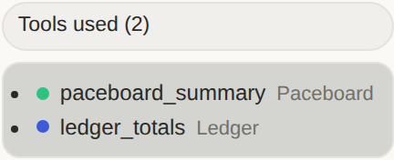

# Chat & voice

The chat view is where almost everything Ava does starts. Typing a message,
attaching a PDF, tapping the mic - all of it enters through one surface, and
**the server owns what happens next**. The browser carries no routing
knowledge, so a turn is auditable, testable, and identical whether you asked
from a laptop or a phone.

## What you can actually do here

| Control | What it does |
|------------|--------------|
| **Copy** | Copies Ava's reply text. |
| **Retry** | Re-asks the same thing, attachments included. |
| **Replay** | Replays the spoken WAV for a voice turn. |
| **Tools used (*n*)** | Expands the tool list for that turn; each chip carries the owning app's identity colour. |
| **Chain of thought** | Collapse or expand the reasoning trace, live or replayed. |
| **Context meter** | Tokens used against the model's usable window (`inference.ctx_max`, default 65,536) - amber from 70 %, red from 90 %. |
| **Attachments** | Multi-file picker with per-file chips; images marked *"text read"* when OCR found something. |
| **Mic** | Tap to start recording, tap again to send it as a voice turn. |
| **Jump to latest** | Appears when you scroll back up. |
| **New chat / delete chat** | From the sidebar; deletions are recorded in the audit ledger. |
| **Ghost mode** | A conversation that leaves no trace. See below. |

**Tools used** is the one worth opening. It is how you check Ava's work: the
answer above it came from these calls, on this machine, and nothing else.

Chats title themselves from your first message (truncated to 48 characters);
the sidebar's search box filters the recents list by title.

## How a message becomes a turn

Everything you send - a question, a follow-up, a file - posts to the single
endpoint **`POST /api/chat-stream`**, and every one of them becomes an agent
turn. The handler returns `{"turn_id": …}` immediately; the client polls only
to *paint* progress, and the bridge persists the outcome either way, so a
browser that dies mid-turn costs you nothing.

## Live chain of thought

While Ava works, you watch her work. Each step appears under a collapsible
**"Thought for *N*s · *N* steps"** header, and it is a record of what actually
happened rather than a stream of reasoning tokens: the agent writes every step
to its session file as it goes, and the bridge tails that file about once a
second.

That trajectory is **durable**. The completed step list is saved with the chat
message, so reopening a conversation replays the reasoning above the reply
exactly as it appeared live - collapsed, marked done. Nothing is reconstructed
or re-inferred.

!!! note "The tool-less path has no chain of thought"

    The [Direct floor](../AGENT_RUNTIME.md) runs without a sandbox and
    therefore without a session file, so it has no live chain of thought. That
    is the honest trade-off of running without a runtime, not a bug.

## Ghost mode

Ghost mode is a conversation that leaves no trace. The chat id is
unregistered, so nothing is ever written to `data/chats.db` - host-side
persistence is a no-op rather than a delete-afterwards. When you leave ghost
mode (toggle off, start a new chat, open an old one, or close the tab), the UI
calls `POST /api/ghost/discard`, which **deletes the agent's session
transcript** so the runtime-side memory of the conversation goes too.

## Files you attach

Attach a document and Ava reads its text. Uploads are capped at 25 MB
(`AVA_MAX_UPLOAD_MB`) with 24,000 characters folded into a turn
(`AVA_MAX_DOC_CHARS`), and the allowed extension list is a fixed set so the
upload directory cannot be used to stash executables or keys.

| Type | How text is extracted |
|------|----------------------|
| PDF | `pdftotext -layout` |
| Office / ODF (`.docx`, `.xlsx`, `.pptx`, `.odt`, …) | headless LibreOffice (`soffice --convert-to txt`) |
| Plain text, CSV, JSON, Markdown, logs | read directly |
| Images | `tesseract` OCR, when installed |

**There is no vision model.** An attached image is stored and shown in the
chat, but only OCR'd text reaches Ava. If OCR finds nothing (or `tesseract`
isn't installed), the message says so plainly: *"The user attached an image …
No text could be extracted from it."* Ava is told the truth rather than being
left to guess at a picture she cannot see.

Extracted text is also chunked into the memory store at upload time, so a
document you shared last month stays findable - see
[Memory & recall](../MEMORY.md).

## Side-panel artifacts

When a turn uses a tool with a rich visual companion, Ava opens a resizable
split panel beside the conversation. **Weather is the one implemented
renderer** today: hero conditions, feels-like / humidity / wind, a week chart
of highs, lows and precipitation, and daily rows. The panel has **Refresh**
and **Close**, and the divider between chat and panel is drag-resizable by
mouse or touch.

The numbers in that panel are not read out of Ava's prose. If anything fails
the artifact is simply omitted; it never blocks or breaks a normal reply.

??? note "How the panel is built, and why that matters"

    The panel is **not** parsed out of the model's prose. The bridge reads the
    `get_weather` tool-call arguments the agent actually used - from the
    session jsonl lines appended since this turn started, so a stale earlier
    call can't leak in - then re-fetches structured data itself from the same
    public source the tool uses (Open-Meteo, no API key). **Refresh** re-runs
    `GET /api/artifact/weather`.

## Voice

Voice is off by default (`features.voice`). Turned off, `/api/talk` returns a
coded `voice_off` response rather than quietly recording anyway.

Turned on, the mic in the composer is a toggle: **tap it to start recording,
tap it again to send.** The placeholder reads *"Listening… tap the mic to
send"* while it is live. Every hop after that degrades rather than fails.

| Step | What happens | What happens if it breaks |
|---|---|---|
| **1. Capture** | The browser records the clip and posts it to `POST /api/talk`. | A clip under ~0.5 s comes back asking you to speak a full sentence, not an error. |
| **2. Decode** | `ffmpeg` converts whatever container the browser produced (webm/opus, mp4/aac) to 16 kHz mono PCM. | - |
| **3. Speaker gate** | Your clip is compared against your enrolled voiceprint. | Below the threshold, Ava answers *"Sorry, I only respond to the enrolled voice"* and the turn never reaches the agent. |
| **4. Transcribe** | The GPU Whisper sidecar on `:8129`, with `AVA_STT=gpu`. | Falls back to local CPU Whisper. A stopped sidecar slows voice; it never breaks it. |
| **5. Answer** | The transcript goes through the same agent path as a typed message, with the same recall and tools. | - |
| **6. Speak** | The Kokoro service returns the WAV, with `AVA_TTS=kokoro`. | Falls back to Piper. A stopped `kokoro-tts` degrades voice *quality*, never voice. |

The speaker gate uses an ECAPA embedding compared by cosine similarity, with a
default threshold of `0.40` (`voice.threshold` in `ava.yaml`).

### Enrolling and testing your voiceprint

**Setup → Agent → Voice** is the whole flow, and it is candid about the security
property at stake: with voice on and no voiceprint enrolled, the panel says
plainly that **the gate is open** and anyone can talk to Ava.

1. **Enroll your voice.** Record a few clips of natural speech in the browser,
   then **Build voiceprint**. Nothing is uploaded anywhere; it stays on this
   machine.
2. **Read the quality stats.** Seconds captured, windows used, windows
   dropped, and min/mean/max consistency, plus a **suggested threshold**
   derived from the worst surviving window. **Apply threshold** saves it.
3. **Test the gate.** Record one more clip and see its similarity scored
   against the threshold, with a plain-English verdict.

**Discard clips** if you'd rather start over.

??? note "How the voiceprint is built"

    Ava windows the speech (4 s windows, 2 s hop), drops near-silent windows,
    embeds each with ECAPA, rejects outliers more than one standard deviation
    below the mean similarity, and saves the averaged voiceprint.

## Two controls that don't do what they look like

!!! note "The header model picker sets the *fallback* model, not the one that answers"

    With the agent runtime active - the default - chat turns think with the
    **sandbox model**, configured by `nemoclaw onboard`, and bypass the
    inference router entirely. The picker steers the router's backends, which
    is the path used if the agent is stopped. The control's own tooltip says
    exactly this. For picking what actually thinks, see
    [Choosing a model](../CHOOSE_A_MODEL.md) and
    [the agent runtime](../AGENT_RUNTIME.md).

!!! note "The composer's Code mode toggle is not wired in this UI"

    Flipping it and sending a message returns a system line pointing you at
    the Control Center. Self-editing is real, but it is driven from
    **Operations → Control Center**, not from the chat composer - see
    [the agent: tools, skills & self-improvement](agent.md).

## Where to go next

- [Memory & recall](../MEMORY.md) - what gets folded into a turn, why, and how
  to read, correct or delete it.
- [On your phone (PWA)](../MOBILE.md) - installing Ava as a home-screen app.
  Voice capture works there; there are no push notifications.
- [Operations](operations.md) - the live view of turns, jobs and the
  approvals that pause a tool call.
- [Data, memory & privacy](data.md) - where chats and uploads actually live on
  disk, and how to export or delete them.
