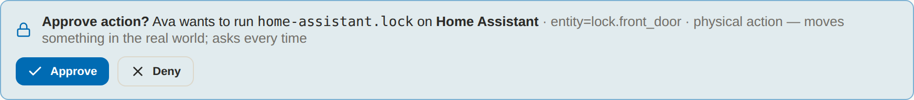

# Operations - live work, alerts & the Control Center

**Operations** is the page you open when you want to know what Ava is doing
*right now*, and what she is waiting on you for. It has two segments:
**Live**, a streaming picture of in-flight work, services, timers and alerts;
and **Control**, where learning proposals and staged code diffs are approved,
rejected or thrown away.

The page updates itself. A single push channel carries changes as they happen,
and a set of polled reads fills in the slower panels. If the push channel
drops, the polled values keep the page current on their own.

The badge on the **Control** tab is the count of learning proposals still
waiting on a decision. When it is empty, nothing is parked.

## When the agent asks: the approvals banner



This is the question that decides whether you let an agent near your apps.
When the agent invokes a connector action that requires your OK, the bridge
**parks the request and blocks the call**. The tool does not return, and the
agent does not proceed, until you decide.

The prompt is a banner on the **Setup** page, and it finds you on whichever
tab you are on: *"Ava wants to run `<action>` on `<connector>`"*, with the
arguments and, for the harsher tiers, the reason it is asking - *destructive -
asks every time*, *physical action - moves something in the real world; asks
every time*.

| Button | Decision | Effect |
|---|---|---|
| **Always allow** | `always` | Runs now **and** writes a durable grant so this action never asks again. |
| **Just once** / **Approve** | `approve` | Runs this one call. The label is *Approve* when there is no grantable option. |
| **Deny** | `deny` | Refuses the call. The agent is told, not left hanging. |

!!! warning "Always allow is a standing grant, not a one-time yes"

    Choosing **Always allow** writes a durable grant to
    `$AVA_HOME/connector_grants.yaml`, and that action will never ask you
    again. It is offered only where the action is grantable: the `write` and
    `sensitive` tiers, and only when the connector's author did not mark the
    action `confirm:`. The `destructive` and `physical` tiers can never be
    granted away, no matter how often you approve them
    (`connectors.grantable()`).

    Grants are revocable at any time from the connector's permission sheet in
    **Setup → Connectors**.

Three numbers govern the wait, and they are deliberate:

| Rule | Value | Why |
|---|---|---|
| Timeout | 120 seconds | No answer is not a yes. The call comes back `timeout` and is refused. |
| Parked-request ceiling | 50 | Past that, new requests **fail closed to denied** rather than queueing up an unbounded pile of things you might accidentally wave through. |
| Wake-up | immediate | The wait uses a condition variable, so your click wakes the blocked call at once. No server-side polling. |

**Everything lands in the ledger.** The request is written as an `approval`
event the moment it is parked (`state: requested`) and again with its outcome
(`approved`, `denied`, `timeout`); granting and revoking are their own `grant`
and `revoke` events. "What did I approve, and when?" is answerable from
**Data → History** without trusting the UI's memory.

## Live

**KPI strip** - Active turns, Services up (*n/m*), Pending approvals, Alerts.
A critical alert also raises a banner across the top of the page.

**Live activity** shows everything in flight. A turn row leads with the reply
preview so far (falling back to the text of its last step, then `thinking…`),
and under it the last step - `→ <tool name>` when the agent is in a tool call,
otherwise the step kind - plus the step and tool counts.

**Device events** appears only once a device has actually pushed something to
this session, newest first, capped at the last 30. Each row carries a severity
badge, `cid/name = value unit`, the message and the age. The panel header
carries a **Speak alerts** checkbox: with it on, events flagged `notify` or
with severity `warn`/`critical` are spoken aloud by the browser's own speech
API. No server-side voice subprocess is involved, and the setting is
remembered in that browser only (`localStorage['ava.speakDeviceAlerts']`). How
a device gets its push token and what a valid payload looks like is in
[Device connectors](../DEVICE_CONNECTORS.md).

**Scheduled tasks** is read from **systemd user timers**
(`systemctl --user list-timers`), showing the task, its next run (absolute and
relative) and its last run. It is literal: if you run Ava somewhere without
user timers, the panel honestly says *"No timers found."* rather than
inventing a schedule.

**Service health** comes from the connector registry - every connector that
declares a `service.probe` gets a row, probed concurrently so one hung app
can't stall the panel. A service whose governing feature you turned **off**
reports as `off`, a neutral state; off-by-choice and crashed are never allowed
to look the same.

**Connectors** lists each registered connector with what it brings (health,
perf, egress-route count, action count), and **Tool usage** ranks the tools
the agent has actually called, counted across the turns currently in memory.

!!! note "What is live is not what is durable"

    Turns are in-process state: a finished turn is dropped an hour later so
    the feed can't grow forever, and one that is still running is never
    evicted no matter how long it takes. The permanent record is the
    append-only audit ledger - **Data → History**, and see
    [Data, memory & privacy](data.md).

## Alerts

Alerts are a small rule engine over **`config/alerts.yaml`**, evaluated
in-process on every tick. A rule is a handful of fields:

```yaml
- id: gpu_temp
  metric: gpu_temp        # a key from the metrics list below
  op: ">"                 # >  <  >=  <=  ==
  value: 85               # threshold
  for: 30                 # how many seconds the breach must last before it alerts
  cooldown: 120           # how long before it may alert again, so it can't nag
  severity: critical      # info | warn | critical
  message: "GPU temperature high"
```

`for` stops a one-sample spike from alerting you; `cooldown` stops a metric
hovering on the threshold from raising and clearing every few seconds. If the
YAML is missing or unparseable the engine falls back to two built-in rules
(GPU temperature and service-down) rather than going silent, and the file is
re-read whenever its mtime changes.

**There is no external paging.** No webhook, no email, no third-party service.
Alerts are single-user and in-process: they surface in the Alerts panel, on
the critical banner, and on the live stream. Nothing leaves the machine.

The engine computes a flat set of metrics each pass. Three examples:

| Metric | What it is |
|---|---|
| `gpu_temp`, `gpu_power`, `mem_used_pct` | Straight from the latest hardware sample. |
| `disk_free_pct` | Free space on the data disk (cached 15 s). |
| `idle_burn_tokens_10m` | Completion tokens generated in the last 10 minutes while no turn was running and more than 120 s after your last interaction - the agent spending on its own while you were away. Zero while you're using it. |

??? note "Every metric the alert engine computes"

    | Metric | What it is |
    |---|---|
    | `gpu_temp`, `gpu_power`, `mem_used_pct` | Straight from the latest hardware sample. |
    | `disk_free_pct` | Free space on the data disk (cached 15 s). |
    | `tokens_per_sec` | Mean throughput across LLM records in the last hour. |
    | `failover_rate_1h` | Share of those records that had to fail over to another backend. |
    | `error_rate_1h` | Share of all perf records in the last hour with an HTTP status ≥ 400. |
    | `service_down_count` | Down count from the same probe the Service health panel uses. |
    | `alloc_degraded_count`, `alloc_unfit_count`, `alloc_unknown_hold_gb` | Allocator health: a declared model whose port answers but that never loaded weights, one that has been unable to start for a while, and memory held by processes Ava doesn't manage. See [Running two models](../ALLOCATION.md). |
    | `budget_daily_pct`, `budget_monthly_pct`, `budget_energy_pct` | Percent of your cloud-spend and GPU-energy caps used today / this month. |
    | `idle_burn_tokens_10m` | Completion tokens generated in the last 10 minutes while no turn was running and more than 120 s after your last interaction. |

The budget and allocation metrics read **0 until you configure them** (a cap
in **Setup → Hardware**, models under `alloc.models`), so those rules sit
dormant on a fresh install instead of firing on defaults you never chose. How
the underlying spend, energy and throughput numbers are measured is on
[Vitals](vitals.md).

One more source feeds the same panel: a device connector's `notify`, `warn` or
`critical` event is injected as a short-lived external alert (90 s by
default), so an urgent reading gets a place in the active-alert list and not
just a transient toast.

## Control - the Control Center

The **Control** segment is where proposals get acted on. Four stat tiles
(Approval gates, Code changes, Completed, Apps), an **Awaiting your approval**
section listing what is parked, and a grid of app cards. Ava herself is always
present; other apps appear only while they are connected, so a project Ava was
pointed at once can't linger in the view.

Opening an app drills into its cycles. For Ava there are two tabs, **Code**
and **Chat**, matching the two proposal streams: edits to her own source, and
behavioural notes. Each cycle expands to the analysis behind it, and each
proposal renders as a card with its title, description, a *Why*, and risk and
status tags.

When a proposal carries staged code changes, the card lists the files with
`+added` / `-removed` counts and a **view diff** toggle that opens a
**per-file unified diff viewer** - added, removed, hunk-header and context
lines coloured - before you decide anything.

**Nothing here applies itself.** A cycle *parks* proposals; the apply call is
the only thing that writes, and the self-editing access policy still governs
what that call is allowed to touch - sensitive paths stage for approval,
secrets and `ava.yaml` are denied outright. That machinery is on
[The agent](agent.md).

| Action | What it does |
|---|---|
| **Approve & apply** (code) / **Approve** (idea) | `POST /api/learning/code/apply` or `/chat/apply`. A proposal with staged changes is written and committed through the code agent; a plain suggestion is just marked approved. |
| **Reject** | `POST /api/learning/{code,chat}/reject` - the proposal is closed, nothing is written. |
| **Yes / No** (after completion) | `POST /api/learning/{code,chat}/feedback` - a thumbs pair on the completed card, so approvals you regretted are on the record. |
| **Run now** | `POST /api/learning/run` - runs a cycle immediately instead of waiting for the schedule, and reports how many proposals it added. |
| **Refresh** | Re-reads `GET /api/learning/code/state` and `/chat/state`. |

If `features.learning` is off the page says so plainly rather than promising
proposals a disabled scheduler will never produce; the cadence is
`learning.interval_hours` (default 24).

## How the live view actually works

One push channel, one set of polls, both cookie-gated like the rest of the
API. Nothing on this page reaches outside your machine to stay current.

??? note "The SSE stream: events, keepalive, and what happens when it drops"

    SSE (Server-Sent Events) is a plain HTTP response the server keeps open
    and writes to as things change. Ava has exactly one:
    **`GET /api/stream/ops`** (`text/event-stream`, `Cache-Control: no-cache`,
    `X-Accel-Buffering: no`). A single async producer runs at **1 Hz**: it
    snapshots the shared runtime state, diffs it against the previous tick,
    and emits **only what changed**. A `: keepalive` comment goes out every
    15 s so proxies don't reap an idle connection, and the loop exits as soon
    as the client disconnects - closing the tab stops the work on the server.

    These are the events that ride that one connection:

    | Event | When it fires |
    |---|---|
    | `alert.state` | Once, on connect - primes the client with the currently active alert set so a fresh tab isn't blank until something breaks. |
    | `turn.update` | A chat turn's status, step count or tool count changed. |
    | `hardware.tick` | Every tick a hardware sample exists. |
    | `device.event` | A connected device pushed an event. |
    | `alert.raise` / `alert.clear` | Alerts are re-evaluated every 5th tick (~5 s); only transitions are sent. |

    Device events are replayed **only from the sequence number current at
    connect time** - opening the page never floods you with an hour of
    backlog.

    If the stream drops, the client reconnects with exponential backoff; until
    it does, the polled values still refresh the page. The stream is an
    accelerant, not a dependency.

    !!! note "There are zero WebSocket endpoints in Ava"

        The live UI is this one SSE stream plus ordinary polling. Nothing
        else, inbound or outbound.

??? note "The polled reads and their cadences"

    Thin reads over the same aggregation layer, each on its own cadence, all
    of them paused while the browser tab is hidden:

    | Endpoint | Feeds | Poll |
    |---|---|---|
    | `/api/ops/summary` | KPI strip + background-workflow rows | 6 s |
    | `/api/turns` | live activity | 6 s |
    | `/api/ops/services` | service health | 12 s |
    | `/api/ops/tools` | tool-usage bars | 15 s |
    | `/api/ops/alerts` | alerts panel (and the alert metric values) | 20 s |
    | `/api/ops/schedule` | scheduled tasks | 30 s |
    | `/api/ops/connectors` | connectors grid | 30 s |

    The approvals banner polls `GET /api/hub/approvals` every 3 s.

    The SSE producer would otherwise hammer `systemctl` and health probes once
    a second, so the reads behind it are TTL-cached server-side (services
    15 s, timers 30 s, the raw perf scan 10 s).

## Where the rules live

This page is where decisions are *made*. The rules that decide whether you are
asked in the first place live next door:

- **Which connector actions ask, which run silently, and which can never be
  granted away** - the four access tiers - are on
  [Apps, devices & MCP](connectors.md), with the full manifest reference in
  the [Connector SDK](../CONNECTOR_SDK.md).
- **Which of Ava's own files she may edit, which stage for approval, and which
  are denied outright** are on [The agent](agent.md).
- **What every alert metric is measured from** is on [Vitals](vitals.md), and
  the durable record of all of it is on [Data, memory & privacy](data.md).
